# rookie-cookies Architecture

- **Author:** maintainers
- **Date:** 2026-08-21 (reconciled after the public job/projection refactor)
- **Status:** Maintained current-state reference
- **Workspace:** repository root
- **Crate:** `rookie-cookies` at `rookie-rs/` (workspace metadata is authoritative for the current version)
- **Kind:** descriptive map of the system as it exists today, not a proposal for a new feature
- **Does not amend:** ADR 0001–0006, `rookie-rs/public-api/*.txt`, `schema/report-dto.schema.json`, `rookie-rs/browser_registry.json`

---

## Overview

`rookie-cookies` extracts cookies from local browser profiles on Linux, macOS, and Windows. A Rust core (`rookie-rs`) owns discovery, acquisition, decryption, and projection. Python (PyO3) and Node (napi-rs) bindings plus a CLI wrap that core. The recommended job is `read`, whose send-side view is `send_view(&SendContext)` (`header` renders from it); `jar` is warning-discarding compatibility projection sugar in Rust, Python, and Node, and since 0.7 (ADR 0006) it also fails closed on a snapshot holding isolated cookies unless the caller opts in, though it stays warning-discarding regardless. Named helpers such as `chrome()` and `load()` remain a compatibility bridge, not a promise.

Internally, extraction is one pipeline with compiler-enforced stage types. Discovery returns `SourceCandidate`; reading a candidate returns `Source`; `Outcome::finalize` is the last shared result; `ExtractionReport`, `Vec<Cookie>`, and `ReadResult` are projections of that result. There is no engine-plugin trait. Four `match` arms on `RegisteredBrowser.engine` (`"chromium" | "gecko" | "safari" | "internet_explorer"`) are the accepted composition.

This document is the current-state map for a contributor who needs to name a stage correctly and find the owning module for a change. Start at [§0 Key classes](#key-classes-one-sentence-catalog) for one-sentence type definitions (same shape as the Language tables in `docs/design/`). The code and generated/public snapshots remain authoritative; this file explains how those pieces compose.

---

## Background & Motivation

This is a maintained fork of archived [`thewh1teagle/rookie`](https://github.com/thewh1teagle/rookie). Downstream still calls `chrome()`, `firefox()`, `load()`, and the eight-field `Cookie`. Those shapes stay through 0.6 and 0.7 so existing consumers keep working; they are deprecated, and a later release will break them.

The tree outgrew a bag of per-browser functions:

- One recommended job (`read`, then the send view for what will be sent) instead of “call `chrome()` and hope”.
- Profile queries so session cookies are a deliberate choice (ADR 0003, ADR 0004).
- Structured reports with provenance, timeouts, and cancellation (ADR 0001).
- Chromium formats through **legacy DPAPI**, **`v10` / `v11`**, and **App-Bound `v20`** where the host and browser allow it.
- One hand-maintained discovery source, `rookie-rs/browser_registry.json` (ADR 0002).
- Stage types that make a listing physically unable to hold extract data (ADR 0005).

Pain points the current architecture already answers:

| Pain | Answer |
| --- | --- |
| Dual discovery stacks (`config.json` vs registry) diverged | Registry is the only hand-maintained source; `CONFIG` is a read-only projection |
| Named APIs would change if they flattened all profiles | `LegacyFirstProfile` vs `AllProfiles` / `ProfileId`; named wrappers never flatten every profile |
| Three disagreeing profile selectors | One crate-private resolver (`resolve_profile_query` / `ProfileMatchCandidate`; ADR 0003 “profile query” is vocabulary, not a Rust type) |
| One bag type served as empty candidate and filled result | `SourceCandidate` vs `Source`, fenced by `xtask check-stage-boundary` |
| Four vocabularies for one pipeline (`query`, `populate`, `Draft`, `canonical_*_extraction`) | Internal stages: resolve, discover, select, lookup, acquire, decode, unseal, finalize, project |

---

## Goals & Non-Goals

### Goals (of this document)

- A contributor can navigate the workspace, name the stages correctly, and find the owning module for a change.
- Public vs internal names, decryption tiers, IDs, and the report-vs-snapshot split are stated once, with file paths.
- Class diagrams and call graphs use the types and fields that exist in source today.

### Non-goals

- Changing the public API, `rookie-rs/public-api/*.txt`, the report DTO, or `browser_registry.json`.
- Re-litigating closed ADRs (engine-plugin trait, dual discovery stacks, line-budget carving, unified Chromium inventory).
- A line-budget carve of long files. Some production files remain long; that is accepted (ADR 0005). `common/sqlite.rs` is not split for architecture.
- Proposing new product features, metrics, or schema migrations.
- Tracking a past refactor's PR sequence. Historical plans live under
  `docs/design/`; this file records the resulting architecture and its
  verification points.

---

## Current Architecture

The five subsections below are the required outline. Later sections (API, data model, alternatives, security, observability, rollout) expand the same system; they do not introduce a new design.

### 0. Key Terminology, concepts, etc.

Law, same as [After the type program — Language](design/after-the-type-program.md#language): **one word, one meaning, one home.** A senior engineer should be able to lint a PR against this section.

Three axes. Do not mix them:

| Axis | What it names | What it is not |
| --- | --- | --- |
| **Aggregation** | Kind of thing: Catalog → Installation → Profile → Source → Record, under a Request | A pipeline step |
| **Stage** | The rustc splits only: listing vs extract at Profile; candidate vs source at Source; decoded vs finalized at Record | Pipeline verbs. Not `SourceFailureStage` (that is a failure-kind enum) |
| **Pipeline step** | Ordered verbs: resolve, discover, select, lookup, acquire, decode, unseal, finalize, project | A typestate `Catalog<Resolve>`. There is no `Installation<Read>` or `Source<Opened>` |

Selection is a **policy**, not an aggregation noun. Keys are Chromium-only. Empty cells stay empty.

The tables below are the current-state class catalog. Field-level Mermaid is in [§3](#3-class-diagram-for-key-classes). Durable rules are [ADR 0005](adr/0005-stage-boundary-types-and-extraction-vocabulary.md). The program records in `docs/design/` are historical (Progress / “home after PR 4” sentences may be stale); where they disagree with this file or the ADR, this file and the ADR win.

#### Key classes (one-sentence catalog)

**Listing vs effective** (say these in signature comments):

| Phrase | Lives on | Who writes it |
| --- | --- | --- |
| **Listing** `selected` / `acquisition` / `exists` | `SourceCandidate` only | Discover. Frozen per engine. A `Source` cannot name these: `origin` is `SourceIdentity` |
| **Effective** `selected` / `acquisition` | `Source.selected` / `Source.acquisition` | Extract states them as constructor arguments. `source_to_draft` copies these |

##### Aggregation

| Class | One-sentence description | Owner | Must not contain |
| --- | --- | --- | --- |
| **Catalog** | Compiled-in registry for this OS, with no disk I/O. | `registry.rs` | Stat'd paths; cookie records; key material |
| **RegisteredBrowser** | One catalog entry after alias resolution: canonical id, engine tag, declared vs available tiers. | `registry.rs` | Filesystem state |
| **BrowserCapabilityDescriptor** | Registry-internal declared/available formats, roles, and decryption tiers (`Vec<String>`). | `registry.rs` | Wire newtypes |
| **BrowserCapabilitiesDescriptor** | Public DTO of the same four lists, using `CookieSourceFormatId` / `CipherTierId`. One letter different from the registry type. | `report_core.rs` | Registry internals |
| **Installation** | One owned canonical root of one registered browser. | Chromium: `BrowserInstallation` in `registry/chromium.rs`. Gecko/Safari/IE: fields on `EngineProfileIdentity` — **no shared type**. | Cookie records; key material (identity may live here) |
| **Profile (inventory)** | A profile directory discovery found, with cookie-source candidates, before any cookie DB is opened for cookies. | Chromium: `ChromiumProfile`. Gecko/Safari/IE: `DiscoveredProfile` | `Vec<Source>`, records, cookies |
| **Profile (selection)** | Which inventory profiles may be acquired. | `ProfileSelection` in `registry.rs`; matcher in `registry/profile_query.rs` | Opened DBs; keys |
| **Profile (wire)** | DTO identity of a profile in a report or descriptor. | `report_core.rs` | Candidates, records |
| **SourceIdentity** | Join keys of one cookie source: path, role, format, precedence. What `source_digest` hashes (plus ids and raw path bytes). The only part of a candidate an extraction result carries. | `source.rs` | `selected`, `acquisition`, `exists`, records, stats, issues, failure |
| **SourceCandidate** | A cookie source discovery found on disk. Listing reports it; extract consumes it. Identity plus **listing** `selected` / `acquisition` / `exists`. | `source.rs` | records, cookies, stats, issues, failure |
| **Source** | What came back from reading one candidate: `origin: SourceIdentity` + **effective** `selected`/`acquisition` + records + stats + optional failure + issues. | `source.rs` | `profile_id`, `installation_id`, `display_name`, a `cookies` field, any listing field |
| **CookieRecord** | Decode-time row, possibly still encrypted. | `cookie_record.rs` | Report identity |
| **FinalizedCookieRecord** | Tuple wrapper `FinalizedCookieRecord(CookieRecord)` after provenance is assigned. | `cookie_record.rs` | — |
| **Cookie** | Frozen eight-field compatibility cookie (`domain`, `path`, `secure`, `http_only`, `same_site`, `expires`, `name`, `value`). | `common/enums.rs` | Provenance, container, ciphertext |

##### Source leaves and acquire

| Class | One-sentence description | Owner | Must not contain |
| --- | --- | --- | --- |
| **SourceIssue** | A fully-formed pre-report issue the engine attached. The mapper only copies. | `source.rs` | Cookie values; key bytes |
| **SourceStats** | Row accounting for one source, copied into `ExtractionStats` without recompute. | `source.rs` | — |
| **SourceFailure** | Acquisition, parse, or query of this named source did not complete. `failed` is derived from `Option<SourceFailure>`, never stored. | `source.rs` | Row skips (those are issues) |
| **SourceFailureStage** | Failure-kind enum (`open`, `parse`, `query`, …). Not the rustc Stage axis. | `source.rs` | — |
| **SourceAcquisition** | One enum, two **homes**: listing claim on `candidate.acquisition`; effective how-we-opened on `Source.acquisition`. | `source.rs` | Journal-mode policy internals |
| **ReadOnlySource** | Marker trait for an **opened capability** (connection, bytes) that a decoder may read. **Not** `Source`. | `common/boundary.rs` | Cookie records; report identity |
| **MozillaCandidateOutcome** | Gecko acquire result: `Source` or a typed miss. Safari/IE still return `Result<Source>`. | `mozilla.rs` | Report identity |

##### Listing vs extract bags

There is no shared `Installation` / `Profile`. Chromium keeps its own inventory; Gecko/Safari/IE share `DiscoveredProfile` / `ExtractedProfile`. Four `match RegisteredBrowser.engine` arms are accepted. There is no engine-plugin trait.

| Class | One-sentence description | Owner | Must not contain |
| --- | --- | --- | --- |
| **EngineProfileIdentity** | Identity fields shared by Gecko/Safari/IE listing and extract profiles (ids, paths, display name). | `registry.rs` | ADR 0002 first-profile rank inputs; cookie records |
| **LegacyRank** | First-profile policy inputs that used to ride on identity. Sibling of `EngineProfileIdentity`. | `registry.rs` | Paths as identity |
| **DiscoveredProfile** | Gecko/Safari/IE listing profile: identity + rank + `candidates: Vec<SourceCandidate>`. | `registry.rs` | `sources`, cookies, records |
| **ExtractedProfile** | Gecko/Safari/IE extract profile: identity + rank + `sources: Vec<Source>`. Not a listing return type. | `registry.rs` | Candidate-placeholder slots |
| **EngineListing** | Gecko/Safari/IE listing bag. Cannot name `Source`. | `registry.rs` | `Vec<Source>` |
| **EngineExtract** | Gecko/Safari/IE extract bag. Not a listing return. | `registry.rs` | Cookie fields beside the sources |
| **ChromiumProfile** | Chromium inventory profile. Convention-enforced boundary (no `cookies`/`records`/`sources` fields; fenced). | `registry/chromium.rs` | Extract data |
| **ChromiumExtractedProfile** | Chromium extract profile: owns `sources: Vec<Source>`, not their contents. | `registry/chromium.rs` | `records`, `stats`, `issues`, `acquisition` restated beside the profile |
| **ChromiumInstallationDraft** | Chromium extract installation bag. | `registry/chromium.rs` | Decoder scratch |
| **ChromiumRegistryDraft** | Chromium extract return to `report_build`. Optional rename leftover; not a leak. | `registry/chromium.rs` | Records beside the profile |
| **SafariProfile** | Private Safari inventory row. | `registry/safari.rs` | BinaryCookies parse |
| **MozillaProfile** | Public persistent-only Firefox profile projection (`firefox_profiles()`). | `mozilla_profiles.rs`, re-exported by `mozilla.rs` | Session-only profiles; registry ids |
| **`registry.rs::ProfileSelection`** | Internal policy applied **before** lookup/acquire: `AllProfiles`, `ProfileId`, `LegacyFirstProfile`. Distinct from the public `selection.rs::ProfileSelection` below, which has a different set of variants; the two share only a name. | `registry.rs` | Opened DBs |
| **ProfileMatchCandidate** | One row the ADR 0003 matcher compares. There is **no** Rust type named `ProfileQuery`. | `registry/profile_query.rs` | Extraction results |

##### Chromium keys

| Class | One-sentence description | Owner | Must not contain |
| --- | --- | --- | --- |
| **ChromiumKeyIdentity** | Lookup coordinates for Chromium OS credentials. Never material. JSON field `key_credentials` is frozen. | `chromium_platform_keys` | Key bytes |
| **ChromiumKeyOutcomes** | Material: independent v10 / v11 / v20 outcomes. | `chromium_crypto` | Identity; cookie rows |

##### Results and projections

| Class | One-sentence description | Owner | Must not contain |
| --- | --- | --- | --- |
| **Outcome** | Canonical finalized extraction. Last shared result before projection. | `outcome.rs` | Engine bags; discovery |
| **SourceOutcome** | One finalized source inside an `Outcome`. | `outcome.rs` | Listing candidates |
| **ExtractionReport** | Frozen grouped-report DTO: `profiles[] → sources[] → cookies[]` plus issues, stats, `status`, `termination`. | `report_core.rs` | Internal drafts |
| **ProfileExtraction** / **SourceExtraction** | Wire profile / source objects inside the report. | `report_core.rs` | Engine types |
| **CookieSourceDescriptor** / **ProfileDescriptor** | Listing projection: role, format, path, precedence. No read products. | `report_core.rs` | `failed`, acquisition strategy, cookies |
| **SourceDraft** | Private report-adaptation hop inside `report_build.rs`. Not crate-visible. Not a fourth engine target. | `report_build.rs` | Engine construction |
| **ReadResult** | ADR 0004 unfiltered snapshot: native `Vec<DetailedCookie>` plus a `Vec<Cookie>` compatibility projection cached once at construction, so `cookies()` stays a free borrow. Structured `ReadWarning`s. | `read.rs` | Report grouping |
| **ReadWarning** | Stable Rust/Python `{ code, count: u64 }`. Node projects `{ code, count: number, countersSaturated, message }`, clamped at `Number.MAX_SAFE_INTEGER`. | `read.rs`; Node projection in `bindings/node/src/lib.rs` | Cookie values |
| **ExtractRequest** | Public `extract` job. **Renamed in 0.6.0** from `Request`, which conflated "first legacy profile" (what `extract` read from it) with "every profile" (what `extract_report` read from the same value). | `lib.rs` | — |
| **ReportRequest** | Public `extract_report` job. Selection is `ReportScope`, which can widen to every profile; `From<ExtractRequest>` narrows to one profile and never widens. | `lib.rs` | — |
| **LoadReportRequest** | The `load_report` fan-out job as data, so it can carry `ExecutionControl`. No selection type: it has nothing to narrow. | `lib.rs` | — |
| **ReadRequest** | Public `read` job. Field is `browser_id`; builder is `ReadRequest::browser()`. | `read.rs` | URL filter on the snapshot |
| **FromPathRequest** | Portable direct-path snapshot request. Does not call the profile resolver. Result `browser_id` is `None` (0.6.0 changed this from the empty-string sentinel). Builds a `direct_path::PathExtractRequest` internally. | `read.rs` | Registry discovery |
| **PathExtractRequest** | Rust direct-path flat-extract request consumed by `extract_from_path`. **New in 0.6.0**, replacing `DirectPathRequest` and `ChromiumPathRequest`: `plaintext` / `sniff` are portable, while `unix_identity` / `windows_local_state` constructors are platform-gated. Lock-policy validity is still checked at runtime where necessary. | `direct_path/mod.rs` | Registry profile discovery |
| **ChromiumCredentialSource** | Portable value carried by `FromPathRequest`: `PlaintextOnly`, `BrowserId(String)`, or `LocalStateFile(PathBuf)`. The variants compile everywhere so bindings can use one options shape; incompatible platforms reject before credential I/O. **`Automatic` was removed in 0.6.0.** | `direct_path/mod.rs` | ABE host policy |
| **ChromiumLockedDatabasePolicy** | Whether `PathExtractRequest` may terminate a process holding its Windows Chromium database: `NonDisruptive` (default) or `AllowProcessShutdown`. | `direct_path/mod.rs` | — |
| **RequestError** | Structured caller-input fault. Bindings map it via `Error::Request` (deprecated `FaultKind` still resolves it to the coarser `Request` bucket). | `request_error.rs` | Engine `Ok(failed report)` |

##### Execution control and typed errors

| Class | One-sentence description | Owner | Must not contain |
| --- | --- | --- | --- |
| **ExecutionControl** | Timeout + `CancellationHandle` + `AppBoundPolicy`, composed into every 0.6 request type. `execution()` replaces it wholesale; the field setters (`timeout` / `cancellation` / `app_bound`) edit one field of the current value. | `execution.rs` | Discovery or engine state |
| **AppBoundPolicy** | Per-request Windows v20 recovery choice: `InjectionOnly` (default), `Disabled`, or `AllowElevatedFallback`. `Disabled` performs no injection/spawn/enumeration/impersonation; `InjectionOnly` never falls back to SYSTEM. Enforced at the v20 key lookup. `ROOKIE_E2E_APPBOUND_MODE` is test/off-feature-only and can only narrow a permitted attempt. | `execution.rs` | Process-global state |
| **`selection.rs::ProfileSelection`** | Public policy on `ExtractRequest` / `ReadRequest`: `LegacyFirst` (default) or `Query(String)`. No "every profile" arm — see `ReportScope`. Direct-path requests do not select registry profiles. Distinct from the internal `registry.rs::ProfileSelection` above; a request's `Query` is resolved into one of that type's variants below the engine boundary. | `selection.rs` | Opened DBs |
| **ReportScope** | Public policy on `ReportRequest`: `AllProfiles` (default) or `One(ProfileSelection)`. Only a report may widen, because only a report has somewhere to put per-profile provenance and failures. | `selection.rs` | — |
| **SessionPolicy** | Whether a job may acquire a browser's declared session store: `PersistentOnly` (default) or `IncludeSession`. An acquire-time candidate filter enforced in `registry/gecko.rs::gecko_profile_plan`, not a post-read cookie filter; Chromium declares no session source, so it is a no-op there. | `session.rs` | — |
| **`BrowserTarget<S>`** | Crate-private `{ browser_id, selection: S, session }` shared by `ExtractRequest` / `ReportRequest` / `ReadRequest`. `S` is `ProfileSelection` or `ReportScope`; execution/App-Bound policy lives separately in `ExecutionControl`. | `target.rs` | Runtime control; direct-path state |
| **SendContext** | View input to `ReadResult::send_view` / `header`: URL, optional top-level site, `ResourceKind`, `MethodClass`, container/private-browsing ids, the four ADR 0006 isolation selectors (`ancestor_chain`, `first_party_domain`, `gecko_view_session_context_id`, raw `origin_attributes`), clock override. One flat list, no nested selector struct. Never applied to the stored snapshot. | `send_context.rs` | Stored cookie state |
| **SendView** / **SendOmissions** | The one selection operation's result: the borrowed `DetailedCookie`s a context selects, in header order, plus a count of every row left out under seven stable reasons. `header()` renders from it. `Debug` prints counts only. | `send_view.rs` | Cookie values in `Debug` |
| **AncestorChain** / **IsolationLoss** | Public `#[non_exhaustive]` enums: `SameSite`/`CrossSite` for the frame-tree selector, `Refuse`(default)/`Allow` for the jar loss policy. | `isolation.rs` | — |
| **Site** / **PartitionIdentity** / **StoredIsolation** / **RequestIsolation** | Crate-private isolation comparison space. `Site` is (scheme, host) with a subdomain containment rule (IP literals compare exactly); `PartitionIdentity` keeps the engines apart — `Chromium { site, port, cross_site_ancestor: Option<bool> }`, `Firefox { site, port, foreign_by_ancestor }`, plus `Unpartitioned`/`Unparsable`. The stored port is identity on both engines, not stripped. `RequestIsolation::verdict` is the single decision point `send_view` and every binding share. No public-suffix list — `top_level_site` is caller-normalized (ADR 0006 Decision 4). | `isolation.rs` | eTLD+1 logic |
| **Error** | Public result-type error hierarchy: `Request(RequestError)` / `Stopped(StopReason)` / `Source(DirectPathError)` / `Engine(EngineError)`. `code()` and `stop_reason()` are the stable machine contract; deprecated `fault_kind()` remains the coarser two-way FFI split. **Changed in 0.6.0**: `rookie_cookies::Result<T>` is now `Result<T, Error>`, not `anyhow::Result<T>` (the deprecated v0.5.9 bridge functions are unchanged and still return `anyhow::Result`). | `error.rs` | Internal `anyhow` chains |
| **EngineError** | Stable code (`no_selected_source` / `source_extraction_failed` / `no_discovered_source` / `discovery_failed` / `source_inspection_failed` / `engine_failure`) plus a sanitized, redacted-path message. | `error.rs` | Raw paths; key material |

##### Compatibility and runtime

| Class | One-sentence description | Owner | Must not contain |
| --- | --- | --- | --- |
| **CompatibilityFamily** | Which compatibility source-set rule and fallback string apply to one browser id. | `compatibility.rs` | Extraction `status` |
| **CompatibilityDisposition** / **CompatibilityDecision** | What the legacy `Cookie[]` projector should do. Vocabulary any projection may name. | `outcome.rs` | Report `status`; the *policy* that produces the value |
| **CompatibilityEvidence** | Typed fact a source carries for compatibility only. Chromium-only `AllRowsRejected` today. Never an extraction issue. | `report_build.rs` | Wire issue list |
| **BoundaryRuntime** | Shared deadline + cancellation budget for one request. | `common/deadline.rs` | — |
| **BrowserDatabaseFailure** | Typed SQLite acquire/query/retry context in the `anyhow` chain. | `common/sqlite.rs` | Report issue codes |

#### Collision resolutions

| Word | Meanings | Law |
| --- | --- | --- |
| **Profile** | Inventory (`ChromiumProfile` / `DiscoveredProfile`); selection (`ProfileSelection` / ADR 0003 matcher); wire (`ProfileIdentity`); public Firefox (`MozillaProfile`) | No shared `Profile`. Say “inventory profile” / “selection” / “wire profile” |
| **Source vs SourceCandidate vs SourceDraft vs SourceOutcome vs SourceExtraction vs ReadOnlySource** | Six types, six jobs | Candidate = listing leaf. Source = post-unseal work. SourceDraft = private report hop. SourceOutcome = finalized canonical. SourceExtraction = wire. ReadOnlySource = opened capability |
| **origin** | (1) `Source.origin: SourceIdentity`. (2) `CookieRecord.origin: SourceRef` (pending ordinal until `assign_provenance`) | Two levels. Never write `origin` unqualified where both are in scope |
| **selected / acquisition** | Listing vs effective | Always qualify when both types are in scope |
| **query** | SQL `WHERE`; ADR 0003 profile matcher; frozen wire `ExtractionStageCode::query()` | Internal verb is SQL or `select` / `resolve`. Do not use `query` for acquire |
| **populate** | Deleted pre-0.6 adapter verb | Use `acquire` for listing-to-extract loops |
| **Draft** | File-private parse scratch; private `SourceDraft` hop; leftover Chromium bag names (`ChromiumRegistryDraft`) | Scratch never crosses a module. `SourceDraft` stays in `report_build` |
| **extract / acquire** | Public job vs internal source work | Public: `extract`. Internal: `acquire` |
| **project** | Last pipeline step only | `Outcome` → `ExtractionReport` / `Cookie[]` / `ReadResult`. Not key-identity mapping |
| **engine** | Catalog discriminant `BrowserEngine`; wire `EngineId`; source files; “engine listing” = Gecko/Safari/IE bags | Catalog: `BrowserEngine`. Wire: `EngineId`. Bags: “Gecko/Safari/IE adapter” vs “Chromium adapter” |
| **Stage** | rustc splits only | Not pipeline steps. Not `SourceFailureStage` |
| **ProfileQuery** | ADR 0003 / ADR 0005 wording for the matcher | **Not a Rust type.** Code: `resolve_profile_query`, `ProfileMatchCandidate`, `ProfileSelection` |

#### Domain vocabulary

| Term | Meaning | Where |
| --- | --- | --- |
| **registered** | A definition exists for the running OS in `browser_registry.json`. No filesystem scan. | ADR 0001 §2, `supported_browsers()` |
| **detected** | A matching installation/profile exists on disk. | Report `browsers_detected` / `browser_not_detected` |
| **readable** | The selected cookie source can be acquired and parsed, including plaintext rows. | ADR 0001 §2 |
| **decryptable** | A cipher tier is both **declared** for that browser/OS and **available** in this build (compiled + feature-gated). | Wire: `report_core::BrowserCapabilitiesDescriptor`. Registry-internal: `registry::BrowserCapabilityDescriptor` (one letter). Same four lists; the public DTO uses `CookieSourceFormatId` / `CipherTierId`, the registry copy uses `Vec<String>`. |
| **installation** | One registry root after template expansion and canonicalization. Opaque `installation_id`. | ADR 0001 §3 |
| **profile** | One cookie-bearing user data directory under an installation. Opaque `profile_id`. | ADR 0001 §3 |
| **source** | One cookie file/database belonging to a profile (persistent or session). | `SourceCandidate` / `Source` / `SourceExtraction` |
| **role** | `persistent` or `session`. Open string newtype `CookieSourceRoleId`. | `report_core.rs` |
| **format** | Engine-native store id, e.g. `chromium_sqlite`, `mozilla_sqlite`, `firefox_session_jsonlz4`, `safari_binary_cookies`. | `CookieSourceFormatId` |
| **selected** | This source is the one the engine committed for its role (first existing persistent; first-valid session). A succeeded-but-unselected source must not be flattened twice. | ADR 0001 §4, `report.rs` module docs |
| **legacy-eligible** | A profile the deleted named-path tables could have admitted. Markerless Gecko recovery is generic-report-only. | `LegacyRank.eligible` |

#### Public names vs internal names

| Public (keep) | Internal (use these) | Do not use internally for |
| --- | --- | --- |
| `extract` / `extract_report` (`lib.rs`) | acquire / decode / unseal / finalize / project | The internal stage that reads a file |
| `ExtractRequest::profile` / `ReadRequest::profile` / `resolve_profile_query` | **select** (ADR 0003 matcher; not a Rust type named `ProfileQuery`) | Anything but the ADR 0003 matcher |
| `ExtractionStageCode::query()` (wire) | SQL in `common/sqlite.rs` | Engine work or profile matching |
| `extract` (crate root) | — | Internal function names for the pipeline |
| Frozen issue codes, `key_credentials` JSON keys | — | Renames; wire identifiers stay |

Deleted as internal *vocabulary* (ADR 0005 Decision 3): `query` except SQL, `populate`, `canonical_*_extraction`, and `Draft` for anything that is already a result. Engine-private parse scratch may keep a local `Draft` name that never crosses a module boundary (`MozillaSessionDraft`, `ChromiumExtractionDraft`, `SessionCookieParseDraft`).

The deliberate mechanical rename authorized by ADR 0005 is complete. Adapter
loops are `acquire_*_sources`; Chromium's candidate boundary is
`acquire_chromium_source_with_runtime`; Mozilla's direct profile walk is
`acquire_mozilla_profile_with_runtime`; and work on an already-open Chromium
SQL connection is `decode_chromium_connection`. Compatibility orchestration
helpers that run acquisition through projection use `extract_*`. No public API,
wire identifier, issue code, registry key, or genuine SQL-stage vocabulary was
renamed.

#### Internal stages

```text
resolve → discover → select → lookup → acquire → decode → unseal → finalize → project
```

| Stage | What it does | Owner |
| --- | --- | --- |
| **resolve** | ID/alias → `RegisteredBrowser`. Unknown ID is `RequestError`, never a report issue. | `browser/registry.rs` |
| **discover** | Expand roots, enumerate profiles, plant `SourceCandidate`s. No cookie DB open. | `browser/registry/*.rs` |
| **select** | Apply `ProfileSelection` (`AllProfiles` / `ProfileId` / `LegacyFirstProfile`) or the ADR 0003 matcher (`resolve_profile_query` / `ProfileMatchCandidate`). Happens **before** credential retrieval and acquisition. | `registry.rs`, `registry/profile_query.rs` |
| **lookup** | Map `ChromiumKeyIdentity` (registry JSON) to `ChromiumKeyOutcomes` (material). Not a “projection”. | `chromium_platform_keys/`, `chromium_crypto/` |
| **acquire** | Open the store (SQLite snapshot, stable file image, ESE). | `common/sqlite.rs`, engines, `chromium_database_acquisition/` |
| **decode** | Bytes → `CookieRecord` with `CookieValue::Encrypted` or `Plain`. No keys. | `chromium_decoder.rs`, `mozilla_*.rs`, `safari.rs`, `internet_explorer_model.rs` |
| **unseal** | Combine records with key outcomes; ciphertext → `Plain` or `Unavailable`. Chromium only. | `browser/unseal.rs` |
| **finalize** | `Outcome::finalize`: provenance digests, counters, `ResultStatus`, independent `Termination`. | `browser/outcome.rs` |
| **project** | `Outcome` → `ExtractionReport` / `Vec<Cookie>` / `ReadResult`. Last stage only. | `report_build.rs`, `legacy.rs`, `read.rs` |

#### Decryption tiers

These are registry `declared_decryption_tiers`, not marketing labels (README “Cookie crypto”).

| Tier | Where | What it is |
| --- | --- | --- |
| **legacy DPAPI** | Windows Chromium | Oldest Windows cookies: current-user DPAPI, no App-Bound wrapping. Row-scoped; no key bucket. Declared for every Windows Chromium browser. |
| **`v10`** | Declared Chromium browsers only (`declared_decryption_tiers`) | AES-GCM (Windows) or AES-CBC (Unix), prefix `v10`. Windows unwraps the AES key from `Local State` with DPAPI. macOS Keychain; Linux OS crypt (often paired with `v11`). Every Windows Chromium browser and every Linux Chromium browser in the registry declare `v10`. Most macOS Chromium browsers do too; macOS **Cốc Cốc** declares `declared_decryption_tiers: []` (no `v10`). |
| **`v11`** | Linux Chromium | Same family as `v10`, prefix `v11`, typically Secret Service / KWallet. Confidential D-Bus session only (`linux/confidential.rs`, security correction C4a). |
| **App-Bound `v20`** | Windows Chrome-family | Chrome 127+ (`APPB` key in `Local State`, values prefixed `v20`). Needs the default `appbound` feature. Unprivileged COM injection targets Chrome 127+; the elevated DPAPI/CNG fallback covers the 127-era formats and the flag-3 form introduced in Chrome 133+. Hosted canaries: Chrome, Edge, Brave. Also declared for Cốc Cốc and Avast. |
| **`(none)`** | Gecko, Safari, IE | Firefox / LibreWolf / Zen / Cachy: plaintext `cookies.sqlite` plus session JSON. Safari: `Cookies.binarycookies` (Full Disk Access). IE: ESE WebCache — functions exist in 0.6 and are deprecated. |

`available_decryption_tiers` is declared ∩ (platform, compiled features). `v20` is available only on Windows with `feature = "appbound"`. `v12` SecretPortal is recognized (`CipherTier::V12SecretPortal`) and routed to `ChromiumKeyRoute::V12SecretPortal` as **unsupported**. A green **legacy DPAPI / `v10`** extraction does **not** mean `v20` works. This project does not implement Device Bound Session Credentials (DBSC) and does not export browser private keys.

Row dispatch: keys are retained independently for v10, v11, and v20; failure of one tier does not discard another; rows dispatch only to their detected prefix (`CipherTier::detect`). Blobs shorter than three bytes are `Malformed` before version detection. Ciphertext is authoritative over a dual-populated plaintext `value` column (security correction `chromium_ciphertext_precedence`).

#### IDs

All public identifiers and codes are **open string newtypes**, not closed enums (`report_core.rs` `string_identifier!`). Compare with `as_str()` / frozen constructors; keep a fallback arm.

Opaque IDs are lowercase 64-character hex SHA-256 (ADR 0001 §3):

```text
installation_id = sha256(
  "rookie-install-v1", canonical_browser_id, root_id, channel,
  normalized_canonical_installation_path
)

profile_id = sha256(
  "rookie-profile-v1", installation_id,
  ("relative", normalized_relative_path)
    or ("absolute", normalized_canonical_profile_path)
)
```

Implemented in `registry.rs` as `installation_id` / `profile_id`, returning `report_core::{InstallationId, ProfileId}` (ADR 0005 Decision 5). They are opaque, case-sensitive, deterministic while registry roots and installed paths remain stable, and **not portable across machines**.

`source_digest` (`outcome.rs`) hashes `"rookie-cookie-source\0v1"` plus length-prefixed browser / installation / profile ids, role, format, precedence, and the **raw path bytes**. Changing the digest inputs is a public behavioural change.

Direct-path synthetic identity is frozen byte-for-byte (ADR 0005 Decision 5): installation id `"0"` × 64, profile id `"1"` × 64, display name `direct`. Constructed once in `report_build::direct_engine_extract`.

A signature must not carry two adjacent same-typed id strings. `source_identity` now takes `&SourceIdentity` rather than four positional `&str`s.

Canonical browser IDs (ADR 0001 §2) include `arc, brave, cachy, chrome, chromium, edge, firefox, internet_explorer, librewolf, octo_browser, opera, opera_gx, safari, vivaldi, zen` plus registry-only ids such as `yandex, duckduckgo, coccoc, avast, …`. Aliases include `ie`, `opera gx`, `opera-gx`, `360`, `qq`, etc. `supported_browsers()` is the live list for the running OS.

#### Report vs snapshot

| | **Report** | **Snapshot** (`read` / `from_path`) |
| --- | --- | --- |
| Type | `ExtractionReport` | `ReadResult` |
| Shape | `profiles[] → sources[] → cookies[]` plus issues, stats, `status`, `termination` | Native flat `Vec<DetailedCookie>` plus a cached `Vec<Cookie>` compatibility projection and structured `ReadWarning`s |
| URL filter | Optional `domains` reducer at extract time (host-boundary matcher) | **Never** URL-filtered. `send_view(&SendContext)` is a view over the snapshot, and `header(&SendContext)` renders that view |
| Session cookies | Always retained for selected profiles (`extract_report` and `load_report` force `IncludeSession`) | `read` defaults to `PersistentOnly`; `include_session()` opts in with or without a profile. `from_path` follows the explicit source and has no registry session policy |
| Failure | `Ok(report)` with `failed` / `partial` / `no_sources` except bad requests | `Err` if no selected source succeeded |
| Bindings | Python dicts / `dto.py`; Node camelCase objects | Python `ReadResult`; Node `ReadResult` |

`status` describes extraction completeness (`complete`, `partial`, `failed`, `no_sources`). `termination` independently describes why work stopped (`completed`, `cancelled`, `timed_out`, `resource_exhausted`). A discovered source whose query succeeds with zero rows is `complete`, not `no_sources`.

#### Compatibility vs the recommended API

| Recommended | Compatibility bridge (deprecated; not a promise) |
| --- | --- |
| `read(ReadRequest)`, then `send_view(&SendContext)` for anything that will be sent; language `jar(...)` is the fail-closed compatibility projection, not the send path | `chrome()`, `firefox()`, `load()`, two-arg `browser()`, `firefox_profile()`, `*_based`, `any_browser` |
| `from_path(FromPathRequest)` | `chromium_based`, `chromium_based_with_browser_id`, `any_browser` |
| `direct_path::extract_from_path(PathExtractRequest)` / binding `extract_from_path` / `extractFromPath` | Binding aliases `cookies_from_path`, `chromium_cookies_from_path`, `chromium_cookies_from_path_detailed` (deprecated; detailed output now comes from `from_path`) |
| `profiles(id)` alias of `browser_profiles` | `firefox_profiles()` (persistent-only `MozillaProfile`) |
| `extract_report` / `browser_report` / bindings `report(...)` | `chrome_profile()` (deprecated shim onto `extract_report`) |
| `ReadResult.send_view(&SendContext)` / `ReadResult.header(&SendContext)` / CLI `send-view` and `header` subcommands | No top-level binding `header()` or `sendView()`. No crate-root `fn get` or `fn report` |

Session policy is orthogonal to profile selection (ADR 0004 Decision 7): **no-profile** `read` uses the compatibility flatten (set-equals `chrome()` / `extract` when `include_expired=true`, persistent / legacy-eligible only); **with-profile** `read` selects one profile via `collect_extraction` + `finalize_outcomes_with_runtime`. Neither route goes through `extract_report` any more — both stop at `FinalizedCookieRecord` and project `DetailedCookie`. Whether the profile's declared session store is acquired is answered separately by `SessionPolicy` (`PersistentOnly` by default, enforced in `registry/gecko.rs::gecko_profile_plan` **before lookup**, so the file is never opened unless asked), and it applies to both routes: `read(ReadRequest::browser("firefox").include_session())` with no profile works, and naming a profile alone does not import session cookies. Earlier prerelease text coupled the two ("with-profile" implied session, "naming the legacy-first profile can return more cookies than omitting it", "session import must pass `profile=`") — that coupling also discarded `CookieContext` through the frozen report DTO, which is why it was replaced rather than kept. Session import now passes `include_session()` / `include_session=True`.

`load()` retains its historical browser set and concatenation order; new browsers do not enter it. `load_report()` covers every registered browser on the running OS.

`*_based` / `any_browser` still exist in 0.6 and are deprecated for 0.7. IE functions exist in 0.6 and are deprecated.

---

### 1. Overall architecture

#### Workspace crates

Root `Cargo.toml` workspace members:

| Member | Package | Role |
| --- | --- | --- |
| `rookie-rs/` | `rookie-cookies` | Core library. Public surface `src/lib.rs`. Default workspace member. |
| `bindings/python/` | `rookie-cookies-python` (`cdylib` `rookie_cookies`) | PyO3 0.29, abi3-py311. Default workspace member. |
| `bindings/node/` | `rookie-cookies-node` (`cdylib`) | napi-rs; async `Task` on the worker pool. Not a default member. |
| `cli/` | `rookie-cookies-cli` binary `rookie-cookies` | clap; JSON / Netscape; job subcommands. |
| `xtask/` | `xtask` (publish = false) | `check-cfg-locations`, `list-cfg-locations`, `check-stage-boundary`. |

`examples/rust/http` is workspace-excluded. Default members are `rookie-rs` and `bindings/python` so `cargo test` from the root does not require Node toolchains.

Features on the core crate (`rookie-rs/Cargo.toml`):

- `default = ["appbound"]` — Windows App-Bound `v20`.
- `appbound` — empty feature flag; gates `available_decryption_tiers` and the Windows injector.
- `dto-schema` — `schemars` derives on report DTO types for `generate-dto-schema` only.
- `e2e-appbound-steering` — empty by default; compiles in `narrow_for_tests`' `ROOKIE_E2E_APPBOUND_MODE` read outside `cfg(test)`, for the Windows App-Bound canary only (`tests/e2e/run_windows_appbound_canary.ps1`). Never enabled in a published build.
- `fuzzing` — internal libFuzzer entry points (`src/fuzzing.rs`, `fuzz/`). Off by default; exposes no supported consumer API.

Feature graphs differ:

- **crates.io `rookie-cookies`:** `default = ["appbound"]`.
- **Workspace bindings:** `workspace.dependencies.rookie-cookies` sets `default-features = false`. Python and Node **Windows** target deps re-enable `features = ["appbound"]`. **Unix** bindings use `rookie-cookies.workspace = true` with that workspace default, so they do **not** enable `appbound` (and `v20` is Windows-only anyway).
- **CLI:** its own `default = ["appbound"]` forwards `rookie-cookies/appbound`.

#### How they compose

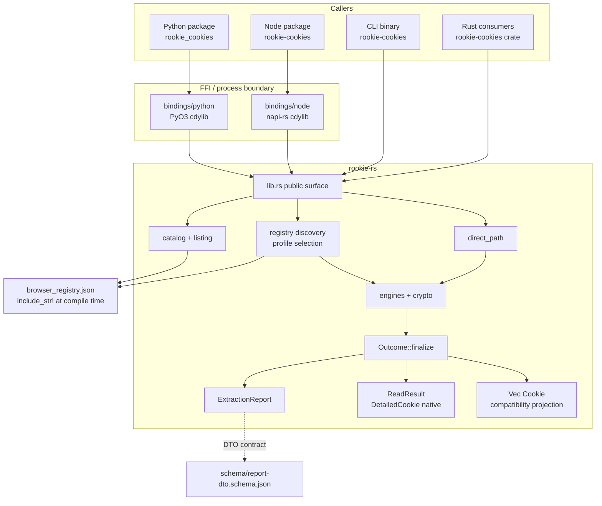

Bindings do not reimplement discovery or crypto. They preserve the crate's four typed error kinds (`Request` / `Stopped` / `Source` / `Engine`). Python exposes `RookieError` with request, stopped, source, and engine subclasses; Node exposes the same four `kind` values plus `rookieCode` while retaining the N-API status in `code`. The deprecated `anyhow::Error` + `fault_kind` two-way bridge still exists for v0.5.9 functions. Bindings convert cookies to language-native objects, Node runs extraction on `AsyncTask`, and Python `read` / `from_path` / report functions use `py.detach(...)`.

The CLI is a thin process: it builds `ExtractRequest` / `ReportRequest` / `ReadRequest` / `FromPathRequest` / `direct_path::PathExtractRequest` and prints JSON or Netscape. **Rewritten in 0.6.0**: it is job-subcommand-only now (`read`, `from-path`, `header`, `report`, `profiles`, `browsers`) — there is no longer a top-level `--browser` / `--load` / `--path` / `--report` / `--list-*` flag grammar, and `cli/src/browsers_map.rs` (the historical name→id validation table) is deleted; a browser id is validated at runtime by the registry, not by clap. Cooperative Ctrl-C (`install_cancel_on_signal` in `cli/src/main.rs`, arming `SIGINT`/`SIGTERM`/Ctrl-Break) covers every subcommand except `browsers`, which reads an embedded in-memory catalog and takes no `ExecutionControl` at all.

#### Process and FFI boundaries

| Boundary | What crosses it | What must not |
| --- | --- | --- |
| PyO3 / napi | Cookies, reports, descriptors, structured warnings, cancellation handle clones. Rust/Python `ReadWarning` is `{ code, count: u64 }`. Node is `{ code, count: number, countersSaturated, message }`; count clamps at `Number.MAX_SAFE_INTEGER` | Key material, `SecretBytes`, cookie values in diagnostics |
| CLI stdout | JSON / Netscape / Cookie header | Warnings go to stderr (`emit_warnings`) |
| COM injection (Windows ABE) | Spawned browser process + native payload (`windows/appbound/native/`) | Exported private keys; the crate returns decrypted **cookie values**, not the master key |
| Keychain / Secret Service / DPAPI | OS credential APIs; Linux uses confidential DH session only | Plain D-Bus secret sessions (C4a) |
| SQLite | Read-only connections; WAL snapshot in a private temp dir | `immutable=1` on live or WAL-bearing DBs; copying `-shm` |

`common/boundary.rs` names the trust-boundary verbs: `ReadOnlySource`, `Decoder`, `KeyProvider`, `RecordSink`. Production acquisition supplies `BoundaryRuntime` directly; the `Acquire` trait is test-only.

#### Platform layers

Platform `cfg` is constrained to an explicit allowlist (issue #218), enforced by `xtask check-cfg-locations` against `cfg-location-allowlist.toml`. Most capabilities use the `mod.rs`-selects-`linux` / `macos` / `windows` / `unsupported` pattern, but the registry is a documented exception: its root and per-engine leaves contain allowlisted target gates for path encoding, native acquisition entry points, and platform-only engines.

| Capability | Leaves |
| --- | --- |
| Chromium key providers | `chromium_platform_keys/{linux,macos,windows,unsupported,shared}.rs` |
| Chromium ciphers | `chromium_crypto/{unix,windows,unsupported}.rs` |
| Chromium DB lock recovery | `chromium_database_acquisition/{mod,windows}.rs` |
| Named compatibility | `compatibility_dispatch/{linux,macos,windows,unsupported,named}.rs` |
| Direct path | `direct_path/{linux,macos,windows,unsupported,shared}.rs` |
| Report remaining engines | `report_build/dispatch/{macos,windows,other}.rs` |
| Legacy remaining engines | `legacy/dispatch/{macos,windows,other}.rs` |
| App-Bound | `windows/appbound/` + `browser/appbound_host.rs` |
| Safari / IE native acquisition | `registry/safari.rs`, `registry/internet_explorer.rs`; parsers remain cross-host testable |

The registry's data model and cross-host parsers stay portable; the registry files themselves are **not** target-agnostic. In particular, `registry.rs` contains Unix/Windows path-byte gates and platform dispatch, while `registry/{chromium,safari,internet_explorer,profile_query}.rs` contain allowlisted target gates. New gates still require an allowlist entry and rationale; “target-agnostic registry” is not an architectural invariant.

Default extraction budget: 30 seconds (`common/deadline.rs` `DEFAULT_EXTRACTION_BUDGET`). One absolute monotonic `Deadline` is created at the operation boundary and copied through every fallback; no boundary turns remaining duration into a fresh budget. `load_report` fans out registered browsers on a pool of `DEFAULT_FAN_OUT_WIDTH = 4` (`common/concurrency.rs`) sharing that one runtime, returning results in registry order.

---

### 2. Key subsystems

#### Registry

`rookie-rs/browser_registry.json` is the only hand-maintained discovery source (ADR 0002). Embedded with `include_str!`, deserialized once into a `Lazy` `Registry`, validated at first use (`schema_version == 1`, unique ids/aliases, engine ↔ discovery strategy pairing, Chromium `key_credentials` vs declared tiers).

Per OS, each `BrowserDefinition` has `canonical_id`, `aliases`, `display_name`, `engine`, `roots[]` (`root_id`, `template`, `channel`, `discovery`, `priority`, optional `legacy_priority` / `legacy_profile_layout`), `capabilities`, optional `key_credentials`.

Discovery strategies: `chromium_user_data`, `mozilla_profiles_ini`, `safari_default_profile`, `internet_explorer_web_cache`.

`DiscoveryContext<F: DiscoveryFs>` + `RealDiscoveryFs` expand templates (`{local_app_data}`, `{home}`, XDG, …) and enumerate. Tests inject `TestDiscoveryFs`.

`ProfileSelection`: `AllProfiles` (full reports), `ProfileId` (explicit report/job profile), `LegacyFirstProfile` (named wrappers). Selection is below the engine boundary so a compatibility wrapper does not extract profiles it will discard.

`CONFIG` / `config::Browser` remain source-compatible; `CONFIG` is a read-only projection of the registry and is **not** consulted for discovery. `config.json` and `common/paths.rs` are gone; CI rejects their restoration.

#### Engines

No plugin trait. `report_build::collect_extraction` / `collect_listing` and `legacy::browser_cookies_and_warnings_with_stop_projection` (the shared body behind `browser_cookies_with_runtime`, `browser_cookies_for_load_with_runtime`, and `browser_detailed_and_warnings_with_runtime`) `match browser.engine`. Chromium and Gecko are portable and stay inline; Safari/IE go through `report_build/dispatch` and `legacy/dispatch` platform leaves.

**Chromium** (`browser/chromium.rs` + `browser/chromium_projection.rs` + `registry/chromium.rs`):

- Inventory: `ChromiumProfile` (candidates only) / `ChromiumExtractedProfile` (sources). `BrowserInstallation`, `ChromiumDiscovery`, `ChromiumListing`, `ChromiumRegistryDraft`.
- Persistent precedence: `Network/Cookies` (10) then `Cookies` (20). Listing stats both, selects the first that `exists`, **omits `!exists` from the extract plan**. Policy `Fixed`. Listing `acquisition` stays `NotAttempted`; the strategy used lands on `Source::acquisition`.
- Chrome-only listing `chrome_profiles()` prefers `Local State.profile.last_used` then `last_active_profiles`; generic `browser_profiles("chrome")` stays default-first.
- Engine boundary: `acquire_chromium_source_with_runtime(...) -> Source` via private `ChromiumExtractionDraft::into_source`.
- `chromium.rs` is the registry-facing acquire/decode engine. `chromium_projection.rs` owns compatibility/direct-path projection and may depend on report finalization. Consequently report assembly reaches the acquire engine without the former `report_build -> registry/chromium -> chromium -> report_build` cycle.
- Acquire options collapsed to `ChromiumAcquireOptions { encrypted_value_policy, acquisition }` (`DirectRead` vs `WithForceKillRecovery`). `EncryptedValuePolicy::UseKeyOutcomes` vs `RejectMissingIdentity` (plaintext-only / missing identity).

**Gecko** (`mozilla.rs`, `mozilla_persistent.rs`, `mozilla_session.rs`, `mozilla_profiles.rs`, `registry/gecko.rs`):

- Inventory: `DiscoveredProfile` / `ExtractedProfile` with `EngineProfileIdentity` + `LegacyRank`.
- Plan: persistent `AcquisitionPolicy::Probe` (`cookies.sqlite`, format `mozilla_sqlite`) then session `FirstValid` run from frozen `SESSION_CANDIDATES` (ADR 0001 §8):
  1. running: `sessionstore-backups/recovery.jsonlz4`, then `recovery.baklz4`
  2. clean-shutdown: `sessionstore.jsonlz4`, then legacy `sessionstore.js`
  3. stale: `previous.jsonlz4`; upgrade files remain disabled
- Lifecycle tier precedes mtime. First valid wins; sources are not merged across tiers. Missing files are silent. Invalid higher-priority file → bounded warning and fallthrough.
- `acquire_by_policy` executes the plan. `FirstValid` is a **lazy** iterator into `mozilla::select_session_sources` so later candidates are never acquired.
- `firefox_profiles()` remains persistent-database-only `MozillaProfile { name, path, is_default }` even though report discovery can expose session-only profiles.
- `MozillaExtract { sources, boundary_stop }`; `MozillaCandidateOutcome::{Source, Missing, Stop}`.

**Safari** (`safari.rs` parser, `registry/safari.rs` inventory): `Cookies.binarycookies`, `AcquisitionPolicy::Fixed`, `SourceAcquisition::StableFileImage`. File-size ceiling 64 MiB. Embedded NUL fields rejected (C4c). macOS Full Disk Access. Inventory types left the decoder (#280).

**Internet Explorer** (`internet_explorer.rs`, `internet_explorer_model.rs`, `registry/internet_explorer.rs`): ESE WebCache, `SourceAcquisition::EseDatabase` overlaid once a query is attempted. Public `internet_explorer` / `internet_explorer_based` and the ESE engine module (`internet_explorer.rs`) are `cfg(target_os = "windows")`. The model/parser (`internet_explorer_model.rs`) is compiled on every target (`browser/mod.rs` ungated `mod internet_explorer_model`) so decoder tests run off Windows.

#### Crypto

Split so decoders never take key deps:

- `chromium_decoder.rs` — key-free SQLite row decoder; emits ciphertext-bearing `CookieRecord`.
- `unseal.rs` — only post-decode consumer that combines records with `ChromiumKeyOutcomes`. Host-hash strip for schema ≥ 24 (`SHA256(host_key)` prefix).
- `chromium_crypto/` — `ChromiumKeyOutcomes { v10, v11, v20 }`, `ChromiumKeyRoute`, `KeyCandidate` (zeroizing, `Debug` redacts bytes), platform decrypt (`unix` AES-CBC / `windows` AES-GCM + ChaCha20-Poly1305 for ABE).
- `chromium_platform_keys/` — `ChromiumKeyIdentity { linux_crypt_name, macos_keychain: { service, account } }` is both the registry JSON DTO and the runtime identity. `ChromiumKeyRequest` carries `LocalStateInput`.
- Windows ABE: `windows/appbound/` is gated by the job's request-local `AppBoundPolicy` carried on `BoundaryRuntime`. `Disabled` stops before all App-Bound work; `InjectionOnly` (the job default) attempts reflective COM injection into a spawned vendor browser and stops there; `AllowElevatedFallback` additionally permits SYSTEM DPAPI + CNG after injection fails. The deprecated v0.5.9 bridge keeps the elevated fallback so its 0.5.8 capability survives 0.6.x. `ROOKIE_E2E_APPBOUND_MODE` cannot steer production and can only narrow an already-permitted attempt in test/off-feature builds. `AppBoundHost` is a required vendor identity (`chrome|brave|edge|coccoc|avast`), inferred from path or `browser_id`; it never defaults to Chrome.
- Linux Secret Service: `linux/confidential.rs` negotiates `dh-ietf1024-sha256-aes128-cbc-pkcs7` only; never retries `plain`.
- `common/secret.rs` — `SecretBytes` / `SecretString` wipe on drop.

#### Acquisition

`common/sqlite.rs` is the SQLite capability (ADR 0001 §7). Long, one job, **not split for architecture**.

`DatabaseAcquisitionStrategy`: `LiveReadOnly`, `VerifiedWalSnapshot`, `VerifiedStaticSingleFile`.

Policy:

- Nonempty WAL → verified DB+WAL snapshot, open `mode=ro`, never `immutable=1`. `-shm` is not copied; SQLite rebuilds it in the private directory.
- Live no-WAL → normal read-only + read transaction; not immutable.
- Active rollback-journal writer must yield a coherent read or typed busy/locked. No raw-copy through it.
- Private immutable path accepts only an already-acquired static **single-file** copy whose acquisition verified no nonempty WAL (or a complete checkpoint) across the copy window.
- Whole-query reacquisition is bounded and restricted to classified snapshot-origin corruption or selected I/O failures. Schema, SQL, and decryption failures are not retried.
- Windows: ordinary acquisition first; platform fallbacks (Restart Manager, optional shadow copy) only for classified sharing violations. Browser termination is opt-in on the **Rust direct-path builder only**: `PathExtractRequest::locked_database_policy(ChromiumLockedDatabasePolicy::AllowProcessShutdown)` (`direct_path/mod.rs`). Default is `NonDisruptive`. CLI, Python, and Node do **not** expose this (`cli/src/args.rs` has no such flag; `cli/tests/snapshot.rs::process_shutdown_is_not_a_cli_option` and the `no_destructive_acquisition` tests in `cli/` and `bindings/` pin that those surfaces never name `AllowProcessShutdown`). Generic/report extraction calls `acquire_chromium_source_with_runtime(..., false, ...)` and never sets it. There is no `--allow-process-shutdown` CLI flag.
- RAII cleanup after owned readers drop. Cleanup failure → bounded warning naming the private directory. Process abort makes no cleanup attempt.

`SqliteReader` declaration order is load-bearing: `connection` drops before `snapshot` so Windows can delete the temp dir.

Non-SQLite: Safari `StableFileImage`; IE `EseDatabase`.

#### Report pipeline

`report_build.rs` is cross-engine assembly. Entry points: `supported_browser_descriptors`, `browser_profile_descriptors`, `chrome_profile_descriptors`, `browser_extraction_report_with_runtime`, `load_extraction_report`.

Direct-path Chromium compatibility projection enters through `chromium_projection.rs`; `report_build` itself depends only on `registry/chromium` and the lower `chromium.rs` acquire engine.

Flow:

1. `resolve_registered_browser`
2. `collect_extraction` / `collect_listing` (`match engine`)
3. Engine returns `ChromiumRegistryDraft` or `EngineExtract` / `EngineListing`
4. Copy helpers `chromium_browser_outcome` / `engine_extract_outcome` build private `BrowserDraft` → `ProfileDraft` → `SourceDraft`
5. `finalize_outcomes_with_runtime` → `Outcome`
6. `project_canonical_report_with_runtime` → `ExtractionReport`

Crate-visible source representations are exactly `SourceCandidate` → `Source` → wire DTO. `SourceDraft` is private to `report_build` (ADR 0005 Decision 6). Direct-path uses one `finalize_singleton_source` seam.

Empty Chromium `sources` means ordinary absence (listing only existing DBs). Empty Gecko/Safari/IE extract `sources` after a listing that planted candidates means vanished / `NoSources`. Both polarities are golden-pinned (ADR 0005 Decision 4).

Report cookies sort by `(domain, path, name, expires, secure, http_only, same_site, value)`. Exact duplicates retain extraction order. Compatibility cookie row order remains unsorted.

Public counters are `u32`; wider internal counts saturate at `u32::MAX` and set `counters_saturated` (avoids Node `u64`/BigInt). `MAX_ISSUE_SAMPLES = 8`.

#### Read / job API

`read.rs` is the 0.6 job layer.

- `ReadRequest`: private fields `target: BrowserTarget<ProfileSelection>` (browser id, profile selection, session policy), `include_expired`, `control: ExecutionControl` (timeout, cancellation, App-Bound policy). Absence is “not called.” The constructor is `ReadRequest::browser(id)`.
- `read`: resolve browser; **no profile** → `browser::report_build::snapshot::browser_snapshot_with_runtime(SnapshotSelection::LegacyFirst)`, itself `legacy::browser_detailed_and_warnings_with_runtime` (compatibility flatten, `Vec<DetailedCookie>`); **profile** → `resolve_profile_query` then the same seam's `SnapshotSelection::Profile(id)`, which runs `collect_extraction` + `finalize_outcomes_with_runtime` directly and projects the selected succeeded sources' records — **not** `extract_report` / `flatten_selected_report_cookies`. **Changed in 0.6.0** (`browser/report_build/snapshot.rs`): the report DTO's `SourceExtraction.cookies` is frozen `Vec<Cookie>`, so a profile-scoped `read` routed through it had already lost `CookieContext` before `header()` ever saw it — `SendContext`/`header` could not raise `IncompleteSendContext` and would silently merge partitions. The snapshot seam stops at `FinalizedCookieRecord` and projects `DetailedCookie` instead, on both routes, and shares one `BoundaryRuntime` since there is no second request to build. Harvest warnings; filter expired (unless `include_expired`), invalid Cookie octets (`invalid_octets`), empty host identity (`malformed_host_identity`), and count-but-keep an unparsable partition key (`unparsable_partition_key`) or a partitioned Chromium row with no readable ancestor bit (`unknown_ancestor_chain`).
- `ReadResult`: not `Clone`; `cookies()`, `detailed_cookies()`, `warnings()`, `browser_id() -> Option<&str>`, `profile_id() -> Option<&str>`, `send_view(&SendContext) -> Result<SendView<'_>>`, `header(&SendContext)`, `jar() -> Result<&[Cookie]>`, `jar_with(IsolationLoss) -> Result<&[Cookie]>`, `into_cookies()`, `into_detailed_cookies()`, `into_jar() -> Result<Vec<Cookie>>`, `into_jar_with(IsolationLoss) -> Result<Vec<Cookie>>`. `Debug` prints counts, not values. `send_view` is the one place a row's sendability is decided; `header` renders its result and matches nothing itself.
- `jar`: the free `jar(request)` is `read(request)?.into_jar()`. Returns `Vec<Cookie>`, discards warnings, and refuses (`RequestError::IsolationLossRefused`, code `isolation_loss_refused`) rather than discarding isolation context — `into_jar_with(IsolationLoss::Allow)` is the explicit opt-in, and its bytes are identical to `into_cookies()`. `cookies()` / `into_cookies()` stay infallible: they are the inventory projection, not a send-safe one.
- `from_path`: does **not** call the profile resolver (ADR 0004). Sniffs via `direct_path::PathExtractRequest` / `detailed_from_path_inner`. Optional `ChromiumCredentialSource`. `browser_id` / `profile_id` on the result are both `None` (0.6.0 changed `browser_id` from the empty-string sentinel to `None`).
- `profiles` is an alias of `browser_profiles`.

Every library language exposes warning-discarding `jar` projection sugar over `read`: Python returns `http.cookiejar.CookieJar` through the patched `ReadResult.as_jar`; Node returns `CookieObject[]`; Rust returns `Vec<Cookie>`. Since 0.7 (ADR 0006) `jar` additionally fails closed on a snapshot holding isolated cookies unless the caller opts in — `IsolationLoss::Allow` via `jar_with`/`into_jar_with` in Rust, `allow_isolation_loss=True` in Python, `allowIsolationLoss: true` on Node's `JarOptions`, `--allow-isolation-loss` on the CLI. That is a change to fallibility only; the successful result is byte-for-byte what 0.6 produced and stays exactly as warning-discarding. Python `from_path`, Node `fromPath`, the CLI `from-path`, and Rust `FromPathRequest` all expose the same portable credential choices: plaintext only, a Unix registry browser id, or a Windows `Local State` path, with mutual exclusion and platform validation before credential I/O.

#### Compatibility dispatch

`compatibility_dispatch/` owns deprecated crate-root named APIs and `load` (because `legacy.rs` “owns no paths, credentials, discovery…”). `named_browser` → deprecated `browser(id, domains)` → `extract(ExtractRequest)`. `load` iterates `legacy_load_browsers()` in a frozen per-OS order (Firefox, Zen, LibreWolf, Opera, Edge, Chromium, Brave, Vivaldi, then platform extras from `extend_legacy_load_browsers`: macOS/Windows add Arc; **linux/macos/windows** add Chrome; Linux also Cachy; macOS Opera GX + Safari; Windows IE + Octo + Opera GX). The `unsupported` leaf is a no-op, so FreeBSD/other Unix `load()` never includes Chrome.

`load` is a **best-effort aggregator** (`named.rs` rustdoc / `aggregate_load_results`): uninstalled browsers are skipped (`is_browser_not_installed`); any other per-browser `Err` is `log::warn!`’d and collected, not fail-fast. Returns `Ok` concatenated cookies if **any** attempted browser succeeded. Returns `Err` only when at least one installed browser was found, every attempted extraction failed, and none succeeded. If nothing is installed, returns an empty `Ok` list. New browsers do not enter `load()`.

`any_browser` classifies the file (`CookieSourceKind`) then dispatches; Chromium identity credentials come from the registry / `key_path`.

#### Bindings

**Python** (`bindings/python/`): `src/lib.rs` registers named functions, report functions, `read` / `from_path`, `CancellationHandle`, and the four-class exception hierarchy. `src/job.rs`: `read` takes browser/profile, expiry/session policy, profile `select`, timeout, cancellation, and App-Bound policy; `from_path` instead takes path plus mutually exclusive `plaintext_only` / `browser_id` / `local_state_path`. `jar`, `profiles`, and `report` are Python-level wrappers in `rookie_cookies/__init__.py` over those registered functions, not extra `#[pyfunction]`s. The default App-Bound value is `"injection_only"`; deprecated named helpers retain elevated-fallback behavior. `ReadResult.header` and `ReadResult.send_view` accept exactly the same argument: a bare URL, a mapping, or the `top_level_site` / `resource` / `method` / `user_context_id` / `private_browsing_id` / `now` / `ancestor_chain` / `first_party_domain` / `gecko_view_session_context_id` / `origin_attributes` keyword selectors mirroring `SendContext`; `send_view` returns `{"cookies", "header", "omitted"}` and `header` is `send_view(...)["header"]`. `ReadResult.compatibility_cookies(*, allow_isolation_loss=False)` is the named eight-field escape hatch, and `as_jar` / the free `jar` take the same keyword and route through it; `as_list()` is unaffected and stays infallible. `src/report.rs` returns dict-shaped DTOs (Rust field names verbatim). `src/errors.rs` exposes `RookieError`; `RookieRequestError + ValueError`; `RookieSourceError` below request; and `RookieStoppedError` / `RookieEngineError`, both also `RuntimeError`. Every instance carries `kind`, `code`, `stop_reason`, `profile_ids`, `source_kind`, `target_os`, `path_redacted`, and `required`. `rookie_cookies/dto.py` contains generated dataclasses. `as_list()` / `__iter__` emit the frozen eight-key dict; `same_site` stays the raw stored integer.

**Node** (`bindings/node/`): extraction, listing, and report entry points are `AsyncTask` / `Promise` (always `await`). `version()` and `to_netscape()` are synchronous; `CancellationHandle.cancel` / `isCancelled` are synchronous. `CookieObject` camelCase; `expires` is `Option<i64>` (values above `i64::MAX` omitted). Report objects camelCase (`schemaVersion`, `countersSaturated`, …). `read({ browser, profile?, includeExpired?, includeSession?, select?, timeoutMs?, appBound? }, cancellation?)` — `select` accepts only `"legacy_first"`, and `"all"` rejects with `conflicting_profile_selection` before any I/O; `jar(options: JarOptions)` reuses that request construction and resolves to its flat `CookieObject[]` projection, refusing an isolated snapshot with `isolation_loss_refused` unless `allowIsolationLoss: true` is set. `JarOptions` is every `ReadOptions` field plus that flag; the flag is deliberately absent from `ReadOptions`, and `read`/`fromPath` reject it by name rather than silently ignoring it. `appBound` is `"disabled" | "injection_only" | "allow_elevated_fallback"`, defaulting to `"injection_only"` on every App-Bound-capable job. `report(options)` is the binding name for `extract_report`; `browserReport` / `loadReport` are the `browser_report` / `load_report` counterparts, each with its own App-Bound options object. `ReadResult.sendView` and `ReadResult.header` both take either a bare URL string or a `SendContextObject` (`url`, `topLevelSite?`, `resource?`, `method?`, `userContextId?`, `privateBrowsingId?`, `ancestorChain?`, `firstPartyDomain?`, `geckoViewSessionContextId?`, `originAttributes?`, `nowEpochSeconds?`), the same view `SendContext` is on the Rust side; `sendView` returns `SendViewObject` (`cookies`, `header`, camelCase `omitted`) and `header` renders from it. Both throw synchronously, since the snapshot is already loaded. Schema-parity tests check `#[napi(object)]` structs against `schema/report-dto.schema.json`. Worker panics are caught (`catch_unwind`).

#### CLI

**Rewritten in 0.6.0.** `cli/src/args.rs`'s `Args` carries only `--version` and a required `JobCommand` subcommand — there is no longer a no-subcommand default action (the old `load()` fallback), so clap-shaped `MissingSubcommand` is raised by hand when neither is given. `--timeout-secs` is on every subcommand except `browsers`; `--app-bound {disabled,injection-only,allow-elevated-fallback}` (kebab-case values, mapped to `AppBoundPolicy` by `parse_app_bound`) is on every subcommand that can reach the v20 key lookup — `profiles` and `browsers` do not take it, since listing never reaches it; `--select` values are `{legacy-first,all}`.

- `read` — `--browser`, `--profile`, `--include-expired`, `--include-session`, `--select` (`all` is always rejected: a snapshot has no "every profile" shape), `--format {json,netscape,detailed}`, `--allow-isolation-loss`.
- `from-path` — positional path, `--include-expired`, `--format`, mutually exclusive `--local-state-path` / `--browser-id` / `--plaintext-only` (`--local-state-path` replaces the pre-rewrite `--key-path`), `--domains` (routes through `extract_from_path`'s flat job instead of `from_path`'s portable, isolation-carrying one; incompatible with `--format detailed`; compatibility-only, and deliberately not extended with the send-selector surface), `--allow-isolation-loss`.
- `header` — the `SendContextArgs` selector (`--url`, `--top-level-site`, `--resource {navigation,subresource}`, `--method {safe,unsafe}`, `--user-context-id`, `--private-browsing-id`, `--ancestor-chain {same-site,cross-site}`, `--first-party-domain`, `--gecko-view-session-context-id`, `--origin-attributes`, `--now <epoch seconds>`) plus `SnapshotArgs` (`--browser`, `--profile`, `--include-session`, `--timeout-secs`, `--app-bound`); builds one flat `SendContext` and renders `ReadResult::header`.
- `send-view` — the same two flattened arg groups as `header`, printing one JSON object: `cookies` (the selected records in `--format detailed` serialization), `header`, and `omitted` (every `SendOmissions::entries()` reason with its count, zeroes included, in that declared order). `header` and `send-view` are two renderings of the one `send_view` selection, never two predicates.
- `report` — `--browser` (optional: omitting it runs the `load_report` fan-out instead of one browser), `--profile` (requires `--browser`), `--domains`, `--select` (requires `--browser`; default is `AllProfiles`, matching `browser_report(id, None, domains)`).
- `profiles` — positional browser, `--timeout-secs` only.
- `browsers` — no arguments; wraps `supported_browsers()`.

`--profile` with `--select all` is `RequestError::ConflictingProfileSelection`, raised by the core `ReportScope::from_binding_options` constructor before any I/O. Node and Python use the same constructor; single-profile jobs share `ProfileSelection::from_binding_options`. A browser id is validated at runtime by the registry (`RequestError::UnknownBrowser`); clap no longer restricts it to a historical name list. There is no `--allow-process-shutdown` flag. `--format json|netscape` on `read`/`from-path` routes through an isolation-loss check, so an isolated snapshot is refused with `isolation_loss_refused` unless `--allow-isolation-loss` supplies `IsolationLoss::Allow`; `--format detailed` carries the context and is never refused. For `from-path --domains`, the CLI sets that policy on `PathExtractRequest`: `extract_from_path` acquires one domain-filtered detailed row set, checks that exact set, and projects the same rows to the flat result. There is no policy/output double read for a concurrent browser update to interleave with, and successful output stays byte-identical. The public compatibility default remains `IsolationLoss::Allow`; the CLI chooses explicitly. Every CLI error object carries `code` and `message`, a `code` may add documented fields, and `incomplete_send_context` / `isolation_loss_refused` add `required` (the selector token list); consumers ignore unknown keys.

#### xtask fences

`xtask/src/stage_boundary.rs` parses the token tree of defining files and fails if a fenced type declares a forbidden field, including under `#[cfg(test)]`. Identifier lint, not a size lint. Bound to **file + name** so an unrelated `struct Source` elsewhere neither satisfies nor trips it.

| Type | File | Forbidden fields |
| --- | --- | --- |
| `SourceIdentity` | `browser/source.rs` | `selected`, `exists`, `acquisition`, `records`, `cookies`, `stats`, `issues`, `failure` |
| `SourceCandidate` | `browser/source.rs` | `cookies`, `records`, `stats`, `issues`, `sources`, `failure` |
| `Source` | `browser/source.rs` | `cookies`, `profile_id`, `installation_id`, `display_name` |
| `DiscoveredProfile` | `browser/registry.rs` | `sources`, `cookies`, `records` |
| `EngineListing` | `browser/registry.rs` | `sources`, `cookies`, `records` |
| `ChromiumProfile` | `registry/chromium.rs` | `cookies`, `records`, `sources` |
| `ChromiumExtractedProfile` | `registry/chromium.rs` | `cookies`, `records`, `stats`, `row_issues`, `issues`, `legacy_error`, `acquisition` |

`xtask/src/cfg_scan.rs` + `allowlist.rs` enforce #218. Both checks run in `.github/workflows/test-rust.yml` on Ubuntu (`check-cfg-locations` then `check-stage-boundary`).

#### Schema / DTO

`rookie-rs/src/browser/report_core.rs` is the source of truth. `schema/report-dto.schema.json` is generated (`cargo run --bin generate-dto-schema --features dto-schema`). `scripts/generate-python-dto.py` regenerates `dto.py`. Node schema-parity test is the JS equivalent. CI `git diff --exit-code` on both generated files. `EXTRACTION_REPORT_SCHEMA_VERSION = 1`. Python/CLI snake_case wire keys; Node camelCase. Structs are `#[non_exhaustive]`.

Public API snapshots: `rookie-rs/public-api/{linux,macos,windows}-{all-features,no-default-features}.txt`, checked by `scripts/check-public-api.py`.

#### Module ownership (ADR 0005 Decision 6)

| Module | Owns | Must not own |
| --- | --- | --- |
| `browser/source.rs` | `SourceIdentity`, `SourceCandidate`, `Source`, `SourceFailure`, `SourceIssue`, `SourceStats`, `SourceAcquisition`, `SourceFailureStage` | profile identity, catalog, listing/extract bags, `DiscoveryIssue` |
| `browser/registry.rs` | catalog, `DiscoveryFs`, ids, `ProfileSelection`, discovery diagnostics and counters, `EngineProfileIdentity`, `LegacyRank`, listing/extract bags | source-leaf definitions, report mapping |
| `browser/registry/*.rs` | per-engine inventory; discover, select, lookup, acquire | cookie format decode and parsing |
| `browser/outcome.rs` | `Outcome`, `SourceOutcome`, finalize, `source_digest`, `CompatibilityDisposition` / `CompatibilityDecision` vocabulary | engine bags, discovery, the compatibility *policy* that produces those values |
| `browser/compatibility.rs` | which browser families exist, which source-set rule each takes, which product string each emits | extraction `status`, assembly |
| `browser/report_core.rs` | the wire DTO and its ordering and aggregation helpers | engine types |
| `browser/report_build.rs` | dispatch arms, orchestration, finalize hand-off, wire projection, the single direct-path finalize seam | per-engine bag mappers, per-engine direct-path identity construction, compatibility disposition and its product strings |
| `browser/chromium_projection.rs` | Chromium compatibility/direct-path request projection and synthetic direct-source construction | registry acquisition, Chromium decode |
| `browser/legacy.rs` | `LegacyFirstProfile` application and `Cookie` projection | paths, credentials, discovery |
| engine modules | path plus keys to `Source`; format decode; public `MozillaProfile` as an ADR 0002 projection | report identity, profile listing types, report finalization |
| `browser/cookie_record.rs` | `CookieRecord`, `FinalizedCookieRecord` | — |

`common/sqlite.rs` is deliberately absent from the table.

---

### 3. Class diagram for key classes

One-sentence definitions, owners, and “must not contain” for these types are in [§0 Key classes](#key-classes-one-sentence-catalog). Diagrams below are the load-bearing fields.

Types are the real structs/enums from source. Huge types show key fields only. UML `+`/`-` here is not crate visibility: public vs `pub(crate)` is `rookie-rs/src/lib.rs` and `rookie-rs/public-api/*.txt`. Public among the diagrams: `Cookie`, `MozillaProfile`, `ExtractionReport` and its children; all request/result types including `PathExtractRequest` and `LoadReportRequest`; `ProfileSelection`, `ReportScope`, `SessionPolicy`; `ChromiumCredentialSource`; `ExecutionControl` / `AppBoundPolicy`; and the typed errors. `BrowserTarget<S>` is crate-private. Stage leaves, registry bags, Chromium inventory, and `Outcome` are crate-private.

#### Stage leaves

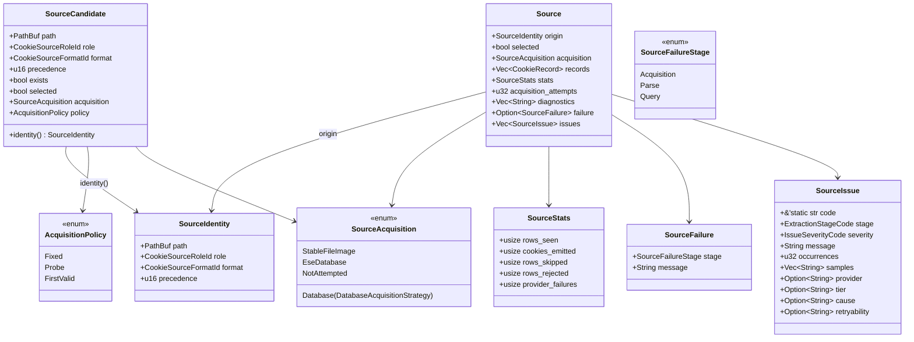

`Source` has no `cookies` field (including under `#[cfg(test)]`). Tests project through `#[cfg(test)] fn cookies()`. `failed` is derived from `failure`, never stored.

#### Registry and Gecko/Safari/IE bags

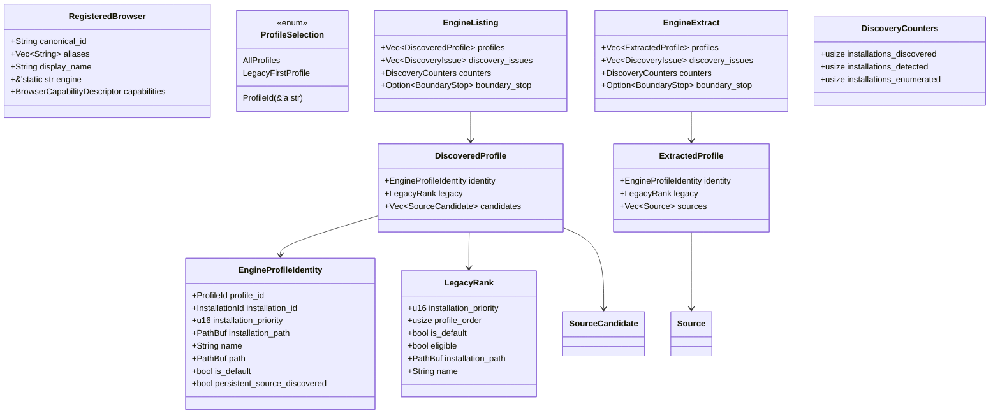

`RegisteredBrowser.capabilities` is `registry::BrowserCapabilityDescriptor` (`Vec<String>` lists). The public wire type is `report_core::BrowserCapabilitiesDescriptor` (newtype ids). Chromium does **not** adopt `EngineProfileIdentity`. `LegacyRank` is selection policy, kept out of a type named identity.

#### Chromium inventory (separate on purpose)

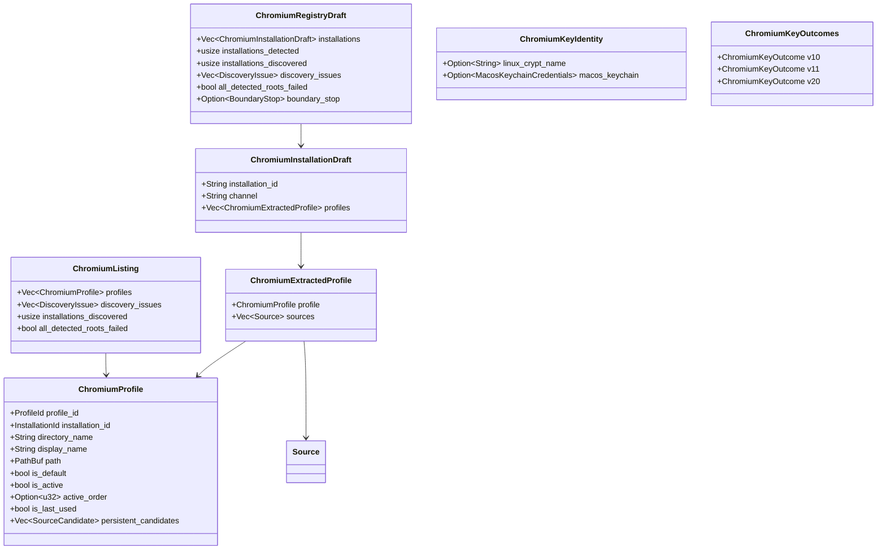

Empty `ChromiumExtractedProfile.sources` is ordinary absence, and means only that: the type deliberately has **no** profile-level `failure` field, because Chromium lists only databases that exist and a failure that reached a named database lands on that `Source::failure` (the acquisition `Err` arm still pushes a `Source`). This is the opposite polarity from the engine listing, where an empty `sources` is itself the failure.

#### Gecko engine results and public Firefox listing

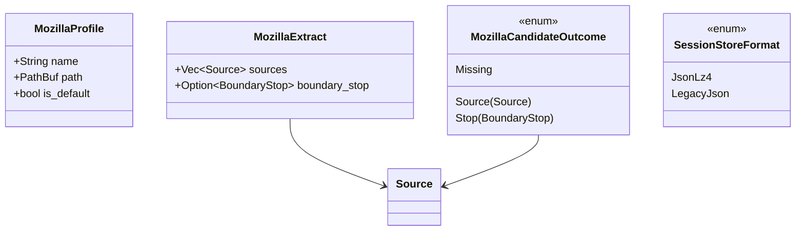

`MozillaProfile` is the public ADR 0002 projection used by `firefox_profiles()`. `MozillaSessionDraft` / `MozillaPersistentDraft` are file-private scratch.

#### Cookie records

```mermaid
classDiagram
  class Cookie {
    +String domain
    +String path
    +bool secure
    +Option~u64~ expires
    +String name
    +String value
    +bool http_only
    +i64 same_site
  }

  class CookieRecord {
    +DomainScope domain
    +String path
    +String name
    +CookieValue value
    +IsolationKey isolation
    +Attributes attributes
    +BTreeMap raw
    +SourceRef origin
  }

  class FinalizedCookieRecord {
    CookieRecord
  }

  class CookieValue {
    <<enum>>
    Plain(SecretString)
    Encrypted { tier CipherTier, bytes Vec~u8~ }
    Unavailable(UnavailableReason)
  }

  class CipherTier {
    <<enum>>
    V10
    V11
    V12SecretPortal
    V20
    LegacyDpapi
    Unknown([u8;3])
    Malformed { observed_len usize }
  }

  class DomainScope {
    <<enum>>
    HostOnly { raw String }
    Domain { raw String }
    Unknown { raw String }
  }

  CookieRecord --> CookieValue
  CookieRecord --> DomainScope
  CookieRecord --> CipherTier
  FinalizedCookieRecord --> CookieRecord : finalize()
  CookieRecord --> Cookie : into_cookie()
```

`FinalizedCookieRecord` is the tuple struct `FinalizedCookieRecord(CookieRecord)` (`cookie_record.rs`); only `CookieRecord::finalize` can construct it, and that rejects `Encrypted` / `Unavailable`. `Cookie` `Debug` redacts `value`. `same_site`: `0` None, `1` Lax, `2` Strict, `SAME_SITE_UNSPECIFIED = -1`.

#### Outcome and report DTO

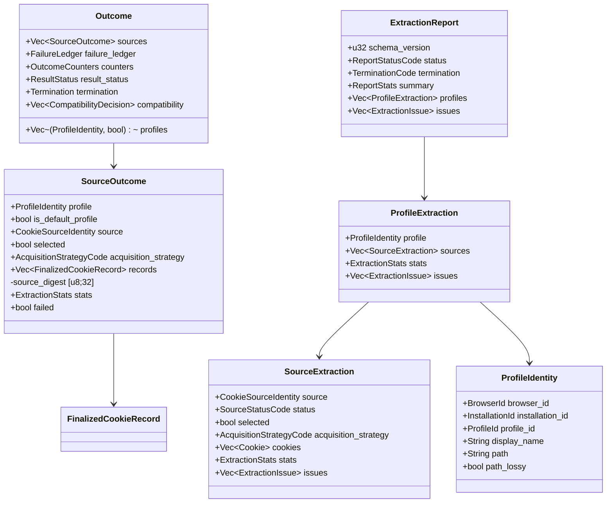

`ResultStatus`: `Complete | Partial | Failed | NoSources`. `Termination`: `Completed | Cancelled | TimedOut | ResourceExhausted`. Independent. `Outcome.profiles` is `Vec<(ProfileIdentity, bool)>` — identity plus `is_default`.

#### Job API

```mermaid
classDiagram
  class BrowserTarget~S~ {
    -String browser_id
    -S selection
    -SessionPolicy session
  }

  class ExecutionControl {
    -Option~Duration~ timeout
    -Option~CancellationHandle~ cancellation
    -AppBoundPolicy app_bound
  }

  class ProfileSelection {
    <<enum>>
    LegacyFirst
    Query(String)
  }

  class ReportScope {
    <<enum>>
    AllProfiles
    One(ProfileSelection)
  }

  class SessionPolicy {
    <<enum>>
    PersistentOnly
    IncludeSession
  }

  class AppBoundPolicy {
    <<enum>>
    InjectionOnly
    Disabled
    AllowElevatedFallback
  }

  class ReadRequest {
    -BrowserTarget~ProfileSelection~ target
    -bool include_expired
    -ExecutionControl control
  }

  class ReadResult {
    -Vec~DetailedCookie~ cookies
    -Vec~Cookie~ projected
    -Vec~ReadWarning~ warnings
    -Option~String~ browser_id
    -Option~String~ profile_id
    +header(SendContext) Result~String~
  }

  class ReadWarning {
    -String code
    -u64 count
  }

  class FromPathRequest {
    -PathBuf path
    -bool include_expired
    -Option~ChromiumCredentialSource~ credentials
    -ExecutionControl control
  }

  class ExtractRequest {
    -BrowserTarget~ProfileSelection~ target
    -Option~Vec~String~~ domains
    -ExecutionControl control
  }

  class ReportRequest {
    -BrowserTarget~ReportScope~ target
    -Option~Vec~String~~ domains
    -ExecutionControl control
  }

  class LoadReportRequest {
    -Option~Vec~String~~ domains
    -ExecutionControl control
  }

  class PathExtractRequest {
    -PathTarget target
    -Option~Vec~String~~ domains
    -ExecutionControl control
  }

  class RequestError {
    <<enum>>
    UnknownBrowser
    EmptyProfileSelector
    UnknownProfile
    AmbiguousProfile
    LossyProfilePath
    MissingBrowser
    InvalidUrl
    InvalidTopLevelSite
    ClockUnrepresentable
    IncompleteSendContext
    IsolationLossRefused
    AppBoundUnavailable
    ConflictingCredentialSelectors
    ConflictingProfileSelection
  }

  class ChromiumCredentialSource {
    <<enum>>
    PlaintextOnly
    BrowserId(String)
    LocalStateFile(PathBuf)
  }

  class Error {
    <<enum>>
    Request(RequestError)
    Stopped(StopReason)
    Source(DirectPathError)
    Engine(EngineError)
  }

  class DirectPathError {
    <<enum>>
    InvalidSource(path, reason)
    InvalidOptions(source, reason)
    UnsupportedTarget(source, target_os, target_arch)
  }

  class InvalidCookieSourceReason {
    <<enum>>
    NotARegularFile
    SourceInspectionFailed
    UnrecognizedSignature
    UnsupportedSqliteSchema
    AmbiguousSqliteSchema
    ExpectedChromiumSqlite
  }

  class EngineError {
    +code()
    +message()
  }

  ReadRequest --> BrowserTarget
  ExtractRequest --> BrowserTarget
  ReportRequest --> BrowserTarget
  BrowserTarget --> SessionPolicy
  BrowserTarget --> ProfileSelection
  BrowserTarget --> ReportScope
  ExecutionControl --> AppBoundPolicy
  ReadRequest --> ExecutionControl
  ExtractRequest --> ExecutionControl
  ReportRequest --> ExecutionControl
  FromPathRequest --> ExecutionControl
  LoadReportRequest --> ExecutionControl
  PathExtractRequest --> ExecutionControl
  FromPathRequest --> ChromiumCredentialSource
  PathExtractRequest --> ChromiumCredentialSource
  ReadRequest --> ReadResult : read()
  FromPathRequest --> ReadResult : from_path()
  ExtractRequest --> Cookie : extract()
  ReportRequest --> ExtractionReport : extract_report()
  LoadReportRequest --> ExtractionReport : load_report_with()
  PathExtractRequest --> Cookie : extract_from_path()
  ExtractRequest ..> ReportRequest : From (narrows only)
  Error --> RequestError
  Error --> DirectPathError
  Error --> EngineError
  DirectPathError --> InvalidCookieSourceReason
  InvalidCookieSourceReason ..> EngineError : SourceInspectionFailed maps to
```

`BrowserTarget<S>` owns browser/profile/session selection; `ExecutionControl` owns timeout/cancellation/App-Bound policy. `ReportRequest` intentionally has no session setter: report jobs always retain the selected profiles' declared session sources. `FromPathRequest` is the portable snapshot wrapper; `PathExtractRequest` is the Rust flat, domain-filterable direct-path job and alone exposes the opt-in locked-database shutdown policy.

Rust/Python `ReadWarning` machine contract is `code` + `count: u64`; `Display` text is diagnostic only. Node projects `{ code, count: number, countersSaturated, message }`, clamps counts above `Number.MAX_SAFE_INTEGER` (`2^53 - 1`), and never exposes a BigInt. Stable codes produced today are `decrypt_failed`, `row_read_failed`, `invalid_octets`, `malformed_host_identity`, `unparsable_partition_key`, and `unknown_ancestor_chain`.

#### Profile query

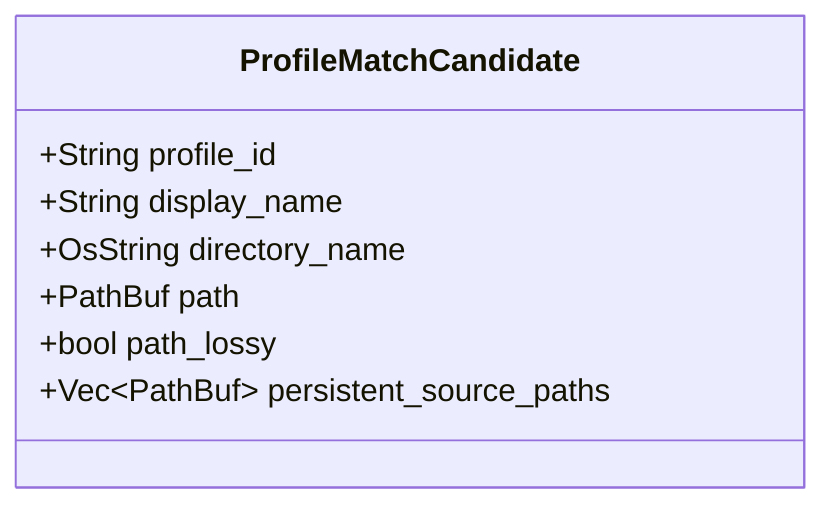

Match order (ADR 0003 + cookie-DB path key): unique opaque `profile_id`, then display name, directory name, non-lossy full path, **or** a persistent source path. Zero or >1 match is `RequestError`. A lossy display path is not a key. Last-used / channel / `is_default` are not tie-breaks.

---

### 4. Data flow or workflow related diagrams

#### `read` (no profile vs with profile)

```mermaid
sequenceDiagram
  participant C as Caller
  participant R as read.rs
  participant Reg as registry
  participant Snap as report_build::snapshot
  participant L as legacy.rs

  C->>R: read(ReadRequest)
  R->>Reg: resolve_registered_browser
  alt no profile
    R->>Snap: browser_snapshot_with_runtime(LegacyFirst)
    Snap->>L: browser_detailed_and_warnings_with_runtime
    L-->>Snap: Vec DetailedCookie + warnings
  else profile query
    R->>Reg: resolve_profile_query
    R->>Snap: browser_snapshot_with_runtime(Profile(id))
    Snap->>Snap: collect_extraction + finalize_outcomes_with_runtime
    Snap->>Snap: project selected succeeded sources' records
  end
  Snap-->>R: SnapshotOutcome (cookies, warnings, termination)
  R->>R: filter_snapshot (expired, sendable_octets, host identity)
  R-->>C: ReadResult (DetailedCookie native + cached Cookie projection)
  C->>R: result.send_view(&SendContext)
  Note over R: expired -> GetFilter (RFC 6265) -> isolation verdict -> SameSite; each omitted row counted once
  R-->>C: SendView (borrowed DetailedCookies in header order + SendOmissions)
  C->>R: result.header(&SendContext)
  Note over R: renders send_view's selection; matches nothing itself; snapshot unchanged
```

**Changed in 0.6.0:** `read` no longer routes a profile-scoped request through `extract_report` / `flatten_selected_report_cookies`. That route lost `CookieContext` at the frozen report DTO boundary before `header()` ever saw it. `report_build::snapshot` stops at `FinalizedCookieRecord` and projects `DetailedCookie` on both routes instead, and both share one `BoundaryRuntime` since there is no second request to build.

#### `extract` / `extract_report`

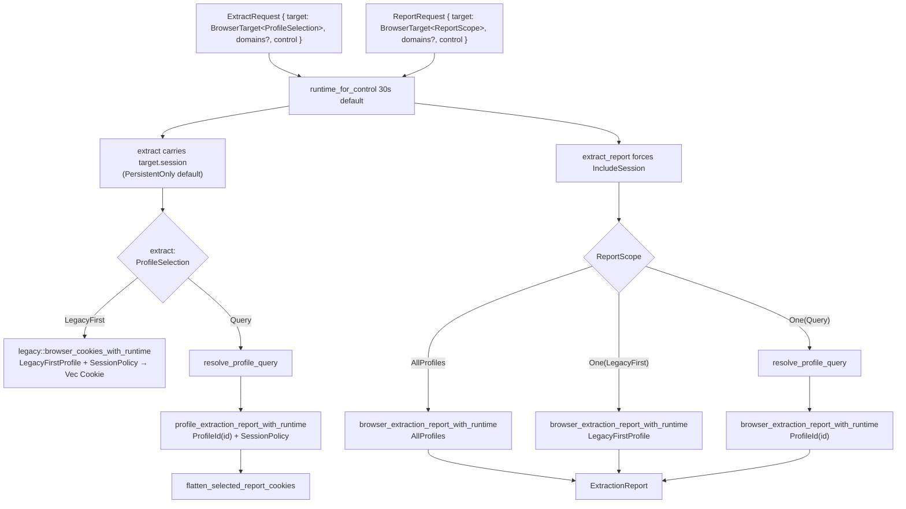

The two flat-extract branches use different compatibility machinery, but they honor the same `SessionPolicy`: `PersistentOnly` by default, `IncludeSession` only when requested. Profile selection does not imply session acquisition. Reports are deliberately different: every report producer retains declared session sources so it can describe the full selected source set.

#### Named helpers (`chrome()`)

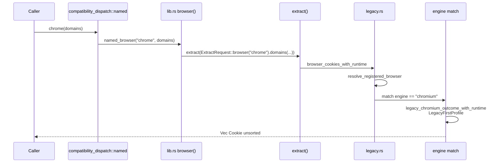

`load()` fans the same frozen browser-id order out over `legacy::browser_cookies_for_load_with_runtime` (not the named wrappers themselves: it forces `PersistentOnly` and projects under `StopProjection::PreserveCommitted`) via `fan_out`, then `aggregate_load_results`: skip missing browsers, warn on other per-browser failures, `Ok` if any succeeded, `Err` only when every attempted installed browser failed. New browsers do not enter this list.

#### `from_path`

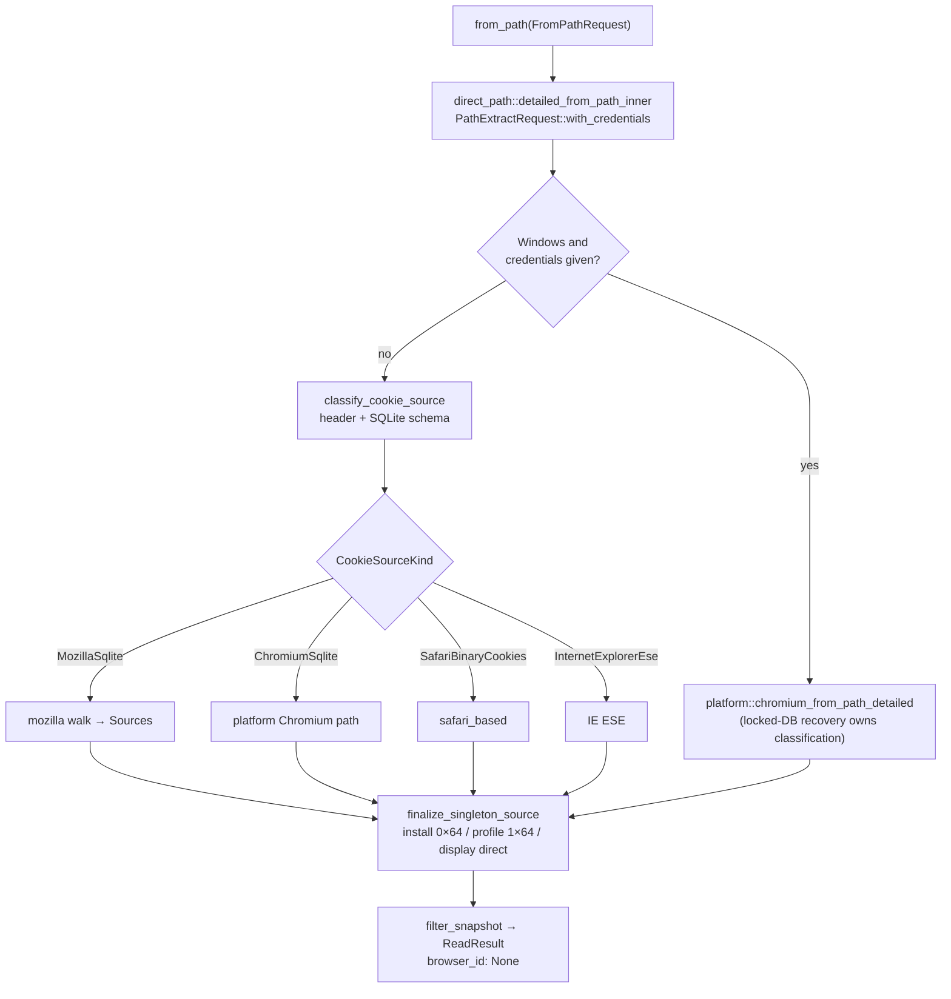

**New in 0.6.0:** `FromPathRequest` builds one `direct_path::PathExtractRequest` regardless of whether Chromium credentials were given — the credential-vs-sniff branch lives in the request's `ChromiumCredentialSource` value, not in which function is called. Rust removed the old path functions. Python and Node retain `cookies_from_path` / `chromium_cookies_from_path` (and their camelCase forms) only as deprecated aliases; their canonical flat job is `extract_from_path` / `extractFromPath`, while detailed output comes from `from_path` / `fromPath`.

Classification attaches `DirectPathError::InvalidSource` without discarding
the underlying typed I/O/SQLite cause. Caller-correctable reasons (missing or
non-file path, unrecognized signature, unsupported/ambiguous schema, or a
recognized non-Chromium source passed to a Chromium request) classify as
`Error::Source` (deprecated `FaultKind::Request`). The operational
`SourceInspectionFailed` reason instead classifies as `Error::Engine`
(`FaultKind::Engine`) with stable code `source_inspection_failed`; the full
diagnostic is sanitized at the public edge and never parsed for policy.
`BoundaryStop` is tested first, so a timeout/cancellation wrapped during source
inspection remains `Error::Stopped`. Direct-path does not consult the profile
resolver.

#### Chromium unseal (v10 / v20 / ABE)

```mermaid
sequenceDiagram
  participant Prov as platform key provider
  participant ABE as windows/appbound
  participant Keys as ChromiumKeyOutcomes
  participant Dec as chromium_decoder
  participant Un as unseal.rs

  Note over Prov,ABE: retrieve_key_outcomes once per installation<br/>before acquire_chromium_source_with_runtime
  Prov->>Prov: Local State / Keychain / Secret Service
  opt Windows v20 and appbound feature
    alt AppBoundPolicy::Disabled
      Prov->>Prov: record provider failure; no App-Bound side effects
    else AppBoundPolicy::InjectionOnly (default)
      Prov->>ABE: COM injection into spawned vendor browser
      Note over ABE: injection failure is final; no SYSTEM fallback
    else AppBoundPolicy::AllowElevatedFallback
      Prov->>ABE: COM injection into spawned vendor browser
      opt injection fails
        ABE->>ABE: elevated SYSTEM DPAPI + CNG fallback
      end
    end
  end
  Prov-->>Keys: ChromiumKeyOutcomes { v10, v11, v20 }

  Note over Dec: CookieValue::Encrypted { tier, bytes }<br/>ciphertext authoritative over plaintext column
  Un->>Keys: route(cipher_version)
  alt v10 / v11 / v20 Candidates
    Keys-->>Un: KeyCandidate[] (zeroizing)
    Un->>Un: validate_keyed_envelope
    loop each candidate of exact length
      Un->>Un: decrypt_keyed_candidate
      Un->>Un: decode_chromium_cookie_value<br/>strip SHA256(host_key) if schema ≥ 24
    end
  else LegacyDpapi
    Un->>Un: decrypt_legacy (row-scoped DPAPI)
  else V12SecretPortal / Unknown / NotApplicable / Failure
    Un-->>Un: CookieValue::Unavailable
  end
```

All applicable providers run once per installation/request. Rows dispatch only to their detected tier.

#### Gecko persistent + session

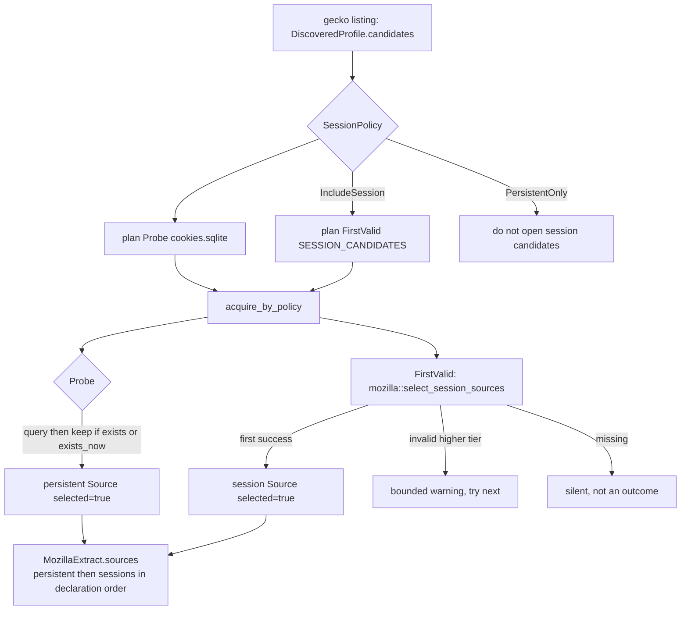

A session-only profile still attempts the persistent probe; `acquire_gecko_sources` drops a failed persistent source when listing never discovered `cookies.sqlite` and it is still absent. Direct-path keeps every attempted source.

#### Report projection

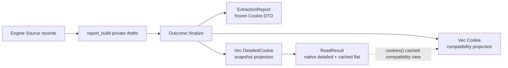

`ReadResult` is never reconstructed from the report wire DTO: doing so would discard `CookieContext`. Snapshot paths project finalized records directly to `DetailedCookie`; the eight-field `Cookie` view is cached once inside the result. Compatibility projection (`browser/compatibility.rs`) chooses which source digests to emit per family: Chromium persistent-only; Gecko persistent plus the selected session source when policy allows it; Safari / IE their single selected source. `all_rows_rejected` is lifted into `CompatibilityEvidence` and does **not** fail the report source (acquisition/parse/query completed) but **does** fail the named-wrapper projection.

---

## API / Interfaces

This section is the current public surface.

### Rust crate root (`rookie-rs/src/lib.rs`)

Recommended:

- `read(ReadRequest) -> Result<ReadResult>`
- `jar(ReadRequest) -> Result<Vec<Cookie>>`
- `from_path(FromPathRequest) -> Result<ReadResult>`
- `profiles(&str) -> Result<Vec<ProfileDescriptor>>`

Still supported, not the lead:

- `extract(ExtractRequest) -> Result<Vec<Cookie>>`
- `extract_report(ReportRequest) -> Result<ExtractionReport>`; `ReportRequest: From<ExtractRequest>` narrows, never widens
- `load_report_with(LoadReportRequest) -> Result<ExtractionReport>`, `profiles_with`, `browser_profiles_with`, `chrome_profiles_with` — `_with` twins carrying `ExecutionControl` for the signatures below that predate it
- `supported_browsers`, `browser_profiles`, `browser_report`, `load_report`, `chrome_profiles`, `chrome_profile` (deprecated)
- `direct_path::{extract_from_path, PathExtractRequest}` — **New in 0.6.0**, replacing the Rust `cookies_from_path` / `chromium_cookies_from_path` / `chromium_cookies_from_path_detailed` functions and the two older request types. Bindings keep deprecated aliases for migration
- `CancellationHandle`, `ExecutionControl`, `AppBoundPolicy`, `SendContext`, `ProfileSelection`, `ReportScope`, `SessionPolicy`, `Error`, `EngineError`, `version`
- `stop_reason`, `fault_kind` — both `#[deprecated(since = "0.6.0")]` in favor of `Error::stop_reason()` / `Error::fault_kind()`

Deprecated compatibility (re-exported from `compatibility_dispatch::named`): `arc`, `brave`, `chrome`, `chromium`, `edge`, `firefox`, `firefox_profile`, `firefox_profiles`, `librewolf`, `load`, `opera`, `opera_gx`, `vivaldi`, `zen`, plus platform `safari` / `cachy` / `internet_explorer` / `octo_browser`; `any_browser`; `chromium_based*`; `chrome_profile`; two-arg `browser(id, domains)`; the `pub use anyhow` re-export (all `#[deprecated(since = "0.6.0")]`, added alongside the typed `Error`).

There is **no** crate-root `fn report` or `fn get`.

`mod browser` is crate-private. `pub use` of `chromium_based` / `firefox_based` / `MozillaProfile` / (cfg) `safari_based` / `internet_explorer_based` remains for the old path APIs.

**Changed in 0.6.0:** `rookie_cookies::Result<T>` is `Result<T, Error>`, not `anyhow::Result<T>`. The deprecated v0.5.9 bridge functions above still return `anyhow::Result<T>`, reachable as `rookie_cookies::anyhow::Result<T>` through the deprecated re-export.

### Python

`read`, `jar`, `from_path`, `extract_from_path`, `profiles`, `report` (the binding job name for `browser_report`), plus named helpers and dict-shaped report/listing APIs. `from_path(path, *, plaintext_only, browser_id, local_state_path, ...)` exposes the three mutually exclusive portable credential selectors and returns a snapshot; `extract_from_path` is the flat, domain-filterable job. `cookies_from_path`, `chromium_cookies_from_path`, and `chromium_cookies_from_path_detailed` remain deprecated aliases only. `ReadResult.as_list()` / `as_jar()` / `header(url_or_kwargs)` preserve their binding conveniences while detailed cookies retain isolation.

The exception hierarchy mirrors the four Rust error variants: `RookieError`; `RookieRequestError + ValueError`; `RookieSourceError` below request; `RookieStoppedError + RuntimeError`; and `RookieEngineError + RuntimeError`. Machine-readable attributes are `kind`, `code`, `stop_reason`, `profile_ids`, `source_kind`, `target_os`, `path_redacted`, and `required`. Typed DTOs in `rookie_cookies.dto` are additive; the dict API remains.

### Node

Extraction, listing, and report entry points are async (`Promise`). `version()` and `to_netscape()` are synchronous. `read(options, cancellation?)`, `jar(options, cancellation?)`, `fromPath(options, cancellation?)`, `extractFromPath(path, options?, cancellation?)`, `profiles`, `report`, `browserReport`, `loadReport`, and named helpers return promises. `jar` resolves to the flat `CookieObject[]` projection. I/O job options carry `timeoutMs?`; extraction/report options that can reach Chromium keys carry `appBound?` (default `"injection_only"`), while listing does not. A loaded `ReadResult` exposes `.cookies`, `.detailedCookies`, and `.warnings`; a warning is `{ code, count: number, countersSaturated, message }`. `ReadResult.sendView(urlOrSendContextObject)` returns `{ cookies, header, omitted }`, and `ReadResult.header(urlOrSendContextObject)` returns that selection's rendered header string. Errors expose `kind`, `rookieCode`, `stopReason`, `profileIds`, `sourceKind`, `targetOs`, `pathRedacted`, and `required`; the N-API status remains in `code`. Cookie `expires` values above `i64::MAX` are omitted.

### CLI

See §2 CLI. **Rewritten in 0.6.0**: the top-level flag grammar (`--browser` / `--load` / `--path` / `--report` / `--list-*`) is gone; the CLI is subcommand-only (`read`, `from-path`, `header`, `report`, `profiles`, `browsers`). Every subcommand except `browsers` arms SIGINT/SIGTERM cancellation. Process shutdown is not a CLI option.

### Errors

`Error` (`Request` / `Stopped` / `Source` / `Engine`) is the crate-wide result error as of 0.6.0; `code()` and `stop_reason()` are the stable machine contract, and deprecated `fault_kind()` remains the coarser two-way FFI split for callers not yet migrated. `RequestError::code()` is the stable branch key: `unknown_browser`, `empty_profile_selector`, `unknown_profile`, `ambiguous_profile`, `lossy_profile_path`, `missing_browser`, `invalid_url`, plus 0.6.0's `invalid_top_level_site`, `clock_unrepresentable`, `incomplete_send_context`, `app_bound_unavailable`, `conflicting_credential_selectors`, `conflicting_profile_selection`, and 0.7's `isolation_loss_refused`. Human `Display` is not stable. `DirectPathError` has `kind()` + reason codes, including new `missing_chromium_credentials`; its operational `SourceInspectionFailed` reason maps to `Error::Engine` without removing the public reason variant. `EngineError::code()` is `no_selected_source`, `source_extraction_failed`, `no_discovered_source`, `discovery_failed`, `source_inspection_failed`, or `engine_failure`. `StopReason` is recovered via `Error::stop_reason()` (or the deprecated free function `stop_reason(&error)` for the `anyhow` bridge) from `BoundaryStop` in the chain.

---

## Data Model

No schema migration is proposed. Current model:

**Three crate-visible source representations:** `SourceCandidate` → `Source` → wire (`SourceExtraction`). The draft hop is private to `report_build`.

**Wire DTO** (`report_core.rs`, `schema/report-dto.schema.json` v1): `ExtractionReport` / `ProfileExtraction` / `SourceExtraction` / `ExtractionIssue` / `ExtractionStats` / `ReportStats` / descriptors. Open newtypes. `u32` counters + `counters_saturated`. Deserialization defaults keep older JSON readable (`schema_version` defaults to 1, `termination` defaults to `completed`, additive counters default to 0).

**Snapshot model:** `DetailedCookie { cookie: Cookie, context: CookieContext }` is the native `ReadResult` element. `CookieContext` retains partition/container identity, unchanged by ADR 0006 — the unknown-vs-default distinction selection needs is computed once per row into the crate-private `StoredIsolation`, never promoted to a public field. A cached `Vec<Cookie>` keeps the compatibility borrow cheap; that eight-field projection intentionally discards isolation, which is why reaching it through a name that promises send-safety (`jar`) refuses unless the caller opts into the loss.

**Compatibility `Cookie`:** eight constructible fields, including raw `same_site: i64`. Unchanged as the flat/report wire value.

**IDs:** `InstallationId` / `ProfileId` validated as 64 hex chars; `BrowserId` and codes as `^[a-z][a-z0-9_]*$`.

**Goldens:** `rookie-rs/tests/goldens/<os>/*.json` pin listing and extract bytes (paths/ids normalized). A golden change requires an explicit re-golden commit stating the reason.

---

## Alternatives Considered

These are alternatives **already recorded** in ADRs, not new hypotheticals.

### 1. Dual discovery stacks (`config.json` + `common/paths.rs` vs registry)

**Rejected by ADR 0002.** Named APIs used `config.json`; profile/report APIs used the registry. Paths, channels, profile selection, credentials, and failure classification diverged. Cost of the chosen path: `CONFIG` remains a compatibility projection that may contain more descriptive path candidates than the old file; callers should use `supported_browsers()` / `browser_profiles()`. Linux `opera_gx` remains a deprecated 0.5 shim that returns an explicit unsupported-platform error.

### 2. Flatten all-profile discovery behind named functions

**Rejected by ADR 0001.** Would change selected credentials, counts, duplicates, ordering, and errors even if signatures stayed the same. `LegacyFirstProfile` vs `AllProfiles` is the separation. New browsers do not enter `load()`.

### 3. Opaque-id-only `browser_report` vs name/path `chrome_profile` / `firefox_profile`

**Superseded by ADR 0003.** One crate-private resolver; `browser_report`’s middle argument is that query. In the rewritten CLI, `read --profile` already has a required browser, and on `report` — where `--browser` is otherwise optional, and omitting it produces the aggregate report — `--profile` requires it; other subcommands do not accept a profile selector. Callers who passed a non-id string to `browser_report` and depended on a request error must stop.

### 4. URL-filtered snapshot / top-level `get` / crate-root `report`

**Rejected by ADR 0004.** Every `read` / `from_path` snapshot is unfiltered. `send_view(&SendContext)` owns isolation-aware send-match and `header(&SendContext)` renders from it (ADR 0006); no consuming HTTP client format (a bare URL, the Python standard-library jar, or Node/Rust flat `jar` records) can own it for a Chromium CHIPS partition or Firefox container cookie, since none of those formats has a field to carry that identity through. No top-level binding `header()` or `sendView()`, no crate-root `fn get` / `fn report`.

### 5. Engine-plugin trait over Chromium / Gecko / Safari / IE

**Rejected by ADR 0005 Alternative 2.** The engines share no useful behavioural abstraction. Chromium skips `!exists`; Gecko plants `Probe` + `FirstValid`; Safari/IE plant `Fixed` and overlay acquisition after the fact. Four `match` arms on `RegisteredBrowser.engine` are acceptable.

### 6. Line-budget file carve (GitHub #260, closed `NOT_PLANNED`)

**Rejected by ADR 0005 Alternative 1.** Treats length as the defect. After a carve, one bag type would still be both a candidate and a result. Production splits still require a cohesion argument; there is no size lint. Relocating a `#[cfg(test)] mod tests` body to a sibling file is a no-op refactor (unchanged `--list` output), not a substitute for the type boundary.

### 7. Unified Chromium inventory (`Installation` / `Profile` shared with Gecko/Safari/IE)

**Rejected for now by ADR 0005 Decision 4** (second amendment). Chromium keeping its own shapes is a decision, not a leak. Cost: three Chromium-armed dispatch sites (`registry/profile_query.rs`, `report_build.rs` `collect_extraction` and `collect_listing`); the stage boundary is type-enforced for Gecko/Safari/IE and convention-enforced for Chromium. Unifying changes golden-pinned listing bytes unless the shared type carries both polarities of empty `sources` / `!exists`. **Revisit when a fifth engine is added, or when a stage-boundary defect ships in the Chromium path.**

### 8. One profile bag with `candidates` beside `sources`; or `enum EngineSource { Candidate, Acquired }`

**Rejected by ADR 0005 Alternatives 4 and 5.** A listing type that can name `Vec<Source>` still accepts a push. Two types are the enforcement; an enum on a shared bag is not. (A `candidates` field beside `sources` was used once as scaffolding during the type program and deleted.)

### 9. Test extraction alone (`#[cfg(test)] #[path]` on oversized files)

**Rejected as a substitute** (ADR 0005 Alternative 3). Makes files scrollable while leaving the stage leak invisible to rustc. Available afterwards as a workbench when a production file is unreviewable.

---

## Security & Privacy Considerations

Extracted cookies are credentials. Do not log them, commit them, or paste them into issues. Use only profiles and accounts you are allowed to access. Security corrections vs ADR 0001, the bundled SQLite pin, and cryptography review status: [`docs/security.md`](security.md).

### Threat model (what this crate does)

The crate reads **local** browser stores of the current user (and, for ABE fallback, may impersonate SYSTEM on Windows). It is not a remote exploit tool. It does not implement DBSC; a decrypted cookie is not always enough to replay a protected Chrome session. It does not export browser private keys.

### Auth / OS credential access

| Platform | Mechanism | Notes |
| --- | --- | --- |
| Windows Chromium v10 | DPAPI on `Local State` `encrypted_key` | Current-user |
| Windows Chromium legacy | Row-scoped DPAPI | No key bucket |
| Windows Chromium v20 | Request-policy gated: injection by default; elevated DPAPI/CNG only under `AllowElevatedFallback` | `AppBoundHost` required; guessing Chrome fails `kValidationDidNotPass` |
| macOS Chromium v10 | Keychain generic password (`service` / `account` from registry) | May prompt; stderr redacted (C4b) |
| Linux Chromium v10/v11 | libsecret / KWallet via `linux_crypt_name` | Confidential session only (C4a) |
| Safari | Full Disk Access to `Cookies.binarycookies` | FDA is a host permission, not something the crate can grant |
| Gecko | No OS secret for cookies | sqlite + session JSON |

Windows ABE COM injection is in-tree (`windows/appbound/native/`: `abe_extractor.c`, `bootstrap.c`, architecture payload). Destructive acquisition (`RmForceShutdown`) is opt-in on `PathExtractRequest::locked_database_policy(AllowProcessShutdown)` only and unused by report/generic paths. CLI, Python, and Node never name that policy (`no_destructive_acquisition` tests in `cli/` and `bindings/`; CLI snapshot rejects `--allow-process-shutdown`).

### Data handling

- `SecretBytes` / `SecretString` / `KeyCandidate` / `Zeroizing` wipe on drop (C4b).
- Diagnostics: `common/diagnostic.rs` redacts paths to `<path>`, bounds to 512 bytes; `Diagnostic::new_with_secrets` replaces cookie values with `<cookie-value>`.
- `Debug` on `Cookie`, `CookieRecord`, `CookieValue`, reports redacts values (C4e). Serde wire and explicit field access still carry values — that is the product.
- Cookie values and key bytes are never included in report issues. Repeated row issues are aggregated with ≤ 8 samples.
- Host matcher: parameterized `LIKE` as a candidate reducer, then the same boundary-aware, case-insensitive host matcher as Safari/session sources. `None` is unfiltered; explicit empty filter matches nothing (ADR 0001 security correction).
- Chromium ciphertext precedence: dual-populated plaintext `value` is discarded when `encrypted_value` is present.
- Cancellation/deadlines are cooperative at most native seams; Keychain child and D-Bus waits are enforceable.

---

## Observability

What exists today — not a metrics proposal.

### Structured warnings (snapshot)

Rust/Python use `ReadWarning { code, count: u64 }`. Codes + count are the machine contract; `Display` is diagnostic only. Node adds `message` and `countersSaturated`, representing `count` as an IEEE-754 number clamped at `Number.MAX_SAFE_INTEGER`. Produced by one shared warning fold across legacy-first, profile-scoped, and direct-path snapshots:

- `decrypt_failed` for Chromium unseal losses.
- `row_read_failed` for non-decryption row/column losses.
- `invalid_octets` for names/values that are not Cookie-header sendable.
- `malformed_host_identity` when a required host identity did not survive decode.
- `unparsable_partition_key` when a Firefox partition key cannot be normalized.
- `unknown_ancestor_chain` when a partitioned Chromium row has no readable `has_cross_site_ancestor` bit.

All three language `jar` projections discard them; `Display` renders one as `N rows affected (code)`, deliberately not "skipped", because `unparsable_partition_key` and `unknown_ancestor_chain` count rows the snapshot keeps and no send context can select. CLI job commands print them on stderr.

### Report issues and status

`ExtractionIssue`: `code`, `stage` (`registry|discovery|acquisition|parse|decrypt|decode|query`), `severity` (`info|warning|error`), `cause`, `provider`, `tier`, `retryability` (`retryable|not_retryable|unknown`), `occurrences`, `samples`, optional browser/installation/profile ids, sanitized `message`.

Aggregation key is the full `(code, stage, scope, cause, severity, retryability)` (`FailureLedger`). Top-level `issues` are request/registry/discovery/installation only; source failures stay on `SourceExtraction`.

`status` + independent `termination`. `load_report`: uninstalled registered browsers increment `browsers_not_detected` rather than emitting a per-browser warning; installed failures emit issues.

### Diagnostics

- `Source.diagnostics`: acquisition retry notes, projected as `source_read_retried`.
- `DiscoveryIssue`: bounded to 32 path samples per code.
- Logging: `log` crate; Python forwards `rookie_cookies` target via `pyo3-log` (not the root logger). CLI uses `tracing-subscriber`.
- No statsd/Prometheus surface. No cookie values in logs if `Debug` is used; do not `println!("{:?}", cookie)`.

### Golden / characterization

Per-engine goldens and ADR 0001–0004 characterization tests are the behavioural freeze. Public-api snapshots fail CI on accidental surface drift.

---

## Compatibility and CI Gates

This document is a docs landing, not a runtime change.

### Compatibility-bridge / 0.7 deprecation posture

From the root README and ADRs:

- 0.6 keeps named helpers (`chrome()`, `firefox()`, `load()`, …) callable while docs lead with `read` plus the send view.
- That compatibility is a **bridge, not a promise**. Later releases will break the old surface.
- `*_based` / `any_browser` exist in 0.6 and are deprecated for 0.7.
- IE functions exist in 0.6 and are deprecated.
- `chrome_profile` is already `#[deprecated(since = "0.6.0", note = "use extract_report(...) or browser_report(...)")]`.
- Snippets document the recommended job surface; package metadata is authoritative for an exact build version.

No feature flag is required to land this file. Rollback is `git revert` of the docs PR.

### What already gates the architecture

CI (`.github/workflows/test-rust.yml`): `check-cfg-locations`, `check-stage-boundary`, public-api snapshots, DTO schema + `dto.py` freshness, `--no-default-features` tests so the non-`appbound` Windows branch cannot rot.

---

## Revisit Triggers and Deferred Work

Only decisions and deferred work already recorded in ADRs or code. Not product brainstorming.

1. **Chromium inventory unification (ADR 0005 Decision 4).** Closed unless a fifth engine is added or a stage-boundary defect ships in the Chromium path. The tax is three Chromium-armed dispatch sites and a convention-enforced boundary on the largest engine.
2. **Historical identifiers (ADR 0005 Decision 3). Resolved.** The deliberate mechanical rename aligned live internal identifiers with the accepted stage vocabulary: adapter walks use `acquire_*`, Chromium database/connection work uses `decode_*`, and full compatibility wrappers use `extract_*`. Frozen wire and genuine SQL `query` identifiers are unchanged.
3. **Compatibility family-fallback strings (after-the-type-program leftover 2).** Detection of all-rows-rejected is counters + issue codes. Substitution of frozen family fallback text still compares a diagnostic against `SourceIssue::generic_row_read_failed_message`. Policy-on-prose for product strings, not for the boolean.
4. **`Error::Source` / `fault_kind` coarseness (`error.rs`). Resolved.** `SourceInspectionFailed` now maps by its typed reason to `Error::Engine` / deprecated `FaultKind::Engine` with stable code `source_inspection_failed`; caller-correctable direct-path reasons remain `Error::Source`, and `BoundaryStop` retains precedence.
5. **ADR 0001 deferred surfaces.** Rich canonical cookie metadata on the public/binding snapshot, CookieEditor output, a non-terminating Windows locked-handle provider, and changing legacy functions to all-profile defaults remain deferred.
6. **v12 SecretPortal.** Recognized, unsupported, until a provider exists.
7. **`acquire_each_candidate` vs `acquire_by_policy`.** Safari/IE still answer `Result<Source>` rather than `MozillaCandidateOutcome`; folding them is the outcome-type unification noted in `registry.rs` (§14b), not required for the current architecture.

`check-stage-boundary` **is** wired into CI (`.github/workflows/test-rust.yml` alongside `check-cfg-locations`). The contrary claim in `docs/design/after-the-type-program.md` is stale relative to this tree.

---

## References

- [ADR 0001](adr/0001-cookie-extraction-compatibility-and-report-contracts.md) — compatibility and report contracts
- [ADR 0002](adr/0002-authoritative-browser-registry.md) — `browser_registry.json`, selection policies
- [ADR 0003](adr/0003-unified-profile-query.md) — one profile resolver
- [ADR 0004](adr/0004-read-is-the-recommended-entry.md) — `read` / snapshot / `header` view / source-policy asymmetry
- [ADR 0005](adr/0005-stage-boundary-types-and-extraction-vocabulary.md) — stage types, vocabulary, module ownership, fence
- [ADR 0006](adr/0006-isolation-safe-send-selection-and-explicit-isolation-loss.md) — isolation-safe send selector, `send_view`, fail-closed jar (implemented in 0.7.0)
- [Stage-boundary program record](design/stage-boundary-refactor.md) — historical motivation, review reasoning, and PR plan; its progress/line references are preserved rather than maintained
- [After the type program](design/after-the-type-program.md) — historical follow-up audit; [Language](design/after-the-type-program.md#language) informed this document's catalog, but the current-state names here win
- [Isolation-safe send selection program record](design/isolation-safe-send-selection.md) — program record for ADR 0006; engine encoding tables, per-language signatures, corpus and e2e plan, PR checklist with the commits that carried each part
- [Security](security.md)
- [Testing](testing.md) · [Building](building.md) · [Troubleshooting](troubleshooting.md)
- `rookie-rs/src/lib.rs`, `read.rs`, `isolation.rs`, `send_view.rs`, `send_context.rs`, `header_filter.rs`, `read_warning.rs`, `request_error.rs`, `browser/{source,outcome,registry,report_core,report_build,compatibility,legacy,unseal,cookie_record}.rs`
- `rookie-rs/browser_registry.json`
- `schema/report-dto.schema.json`
- `xtask/src/stage_boundary.rs`
- Root [README](../README.md)

---

## Key Decisions

Map of **existing** decisions. Not new ones.

1. **Named APIs stay legacy selectors (ADR 0001).** Signatures, eight-field `Cookie`, `load()` set/order, unsorted rows, and first-profile priority stay. New all-profile discovery is never flattened behind an existing function. Named-selector failures must not collapse into plausible successful empty output. `load()` itself is a best-effort aggregator (`aggregate_load_results`): skip missing browsers, warn on other failures, `Ok` if any succeeded.

2. **`browser_registry.json` is the only hand-maintained discovery source (ADR 0002).** Policies: `AllProfiles`, `ProfileId`, `LegacyFirstProfile`. Selection before lookup/acquire. `CONFIG` is a projection, not an input.

3. **One profile resolver (ADR 0003).** Unique match against opaque id, display name, directory name, non-lossy path (and persistent DB path). Ambiguous / empty / lossy are request errors. CLI profile selection exists only on `read` and browser-scoped `report` jobs.

4. **`read` is the recommended entry (ADR 0004).** Snapshots are unfiltered. `send_view(&SendContext)` is the one selection operation Rust, Python, Node, and the CLI all delegate to, and it owns isolation-aware send-match rather than the consuming HTTP client; `header(&SendContext)` is a view that renders `send_view`'s result and matches nothing itself (ADR 0006). Rust, Python, and Node expose warning-discarding `jar` projection sugar over `read`; since 0.7 (ADR 0006) `jar` also fails closed on a snapshot holding isolated cookies unless the caller explicitly opts into the loss, though it remains warning-discarding either way and its successful output is byte-for-byte unchanged. Session policy is orthogonal to profile selection (Decision 7, amended in 0.6.0): neither route goes through the report flatten any more; `SessionPolicy` (`include_session()`, default `PersistentOnly`) answers whether the session store is opened, independent of whether a profile was named. No crate-root `get` / `report`.

5. **Listing values cannot hold extract data (ADR 0005 Decision 1).** `SourceCandidate` vs `Source`; `Source` embeds `origin: SourceIdentity`; `selected` / `acquisition` are constructor arguments on `Source`; `failure: Option<SourceFailure>` replaces `error` + `error_stage`. Fenced by `check-stage-boundary`.

6. **Internal verbs are resolve / discover / select / lookup / acquire / decode / unseal / finalize / project (ADR 0005 Decision 3).** `extract` remains the public name. Wire `query` stage code is not renamed.

7. **Only source-level types are unified (ADR 0005 Decision 4).** No shared `Installation` / `Profile`. No engine-plugin trait. Chromium inventory shapes stay; revisit trigger is a fifth engine or a Chromium stage-boundary defect.

8. **Ids reuse public `InstallationId` / `ProfileId` (ADR 0005 Decision 5).** Direct-path synthetic ids are frozen. Two adjacent same-typed id strings are forbidden.

9. **Module ownership table (ADR 0005 Decision 6).** `compatibility.rs` owns family policy and product strings; `outcome.rs` owns the disposition vocabulary any projection may name; `report_build.rs` does not.

10. **Chromium keys are independent per tier (ADR 0001 §6).** v10 / v11 / v20 providers all run; rows dispatch by prefix; raw DPAPI is row-scoped; v12 is known-unsupported.

11. **SQLite acquisition policy (ADR 0001 §7).** WAL snapshot vs live RO vs verified static single-file. No `-shm` copy. No immutable live reads. Windows sharing-violation fallbacks only. Termination opt-in only.

12. **Firefox session lifecycle is frozen (ADR 0001 §8).** `SESSION_CANDIDATES` in `mozilla.rs` is the single source of truth for listing, extract, and direct-path.

13. **Ciphertext is authoritative** (`chromium_ciphertext_precedence`). Dual-populated plaintext is not a fallback.

14. **Linux Secret Service is confidential-only (C4a).** No `plain` session retry.

15. **Platform cfg lives in capability leaves (#218).** Core files have grandfathered ceilings; new cfg in a core file needs a reason.

16. **Open string newtypes, non-exhaustive DTOs, `u32` counters.** New engines/tiers/codes cannot break downstream matches; Node does not see BigInt counters.

17. **Compatibility is a bridge, not a promise.** Plan on migrating off `chrome()` / `load()` / `*_based` before they are removed. 0.7 removes none of them; the deprecation window is still open.

18. **An unreadable isolation dimension is unknown, never the default (ADR 0006).** Chromium matching includes the persisted `has_cross_site_ancestor` bit and the key's explicit port; Firefox `partitionKey` is the strict grammar `(scheme,host[,port][,f])` and all five `OriginAttributes` equality fields are compared. A stored `None` never matches a supplied selector, a supplied selector never matches a stored unrecognized attribute name, and an opaque row is reachable only by naming its raw `origin_attributes` suffix byte-for-byte — necessary, not sufficient. `ancestor_chain` and the Firefox partition port are derived from the request and `top_level_site`, so neither is ever a demand token; the six tokens (`top_level_site`, `user_context_id`, `private_browsing_id`, `first_party_domain`, `gecko_view_session_context_id`, `origin_attributes`) are append-only and shared by `incomplete_send_context` and `isolation_loss_refused`. No public-suffix list: `top_level_site` is caller-normalized, and site membership is same-scheme host equality or subdomain containment, with IP literals compared exactly.

---

## Maintenance and Verification

This is a maintained reference, not a rollout plan. When a public job shape or internal boundary changes, update this file in the same change and verify it against:

- `rookie-rs/src/{lib,read,execution,selection,session,target,error}.rs` and `rookie-rs/src/direct_path/mod.rs` for request, selection, control, projection, and error contracts.
- `rookie-rs/src/browser/{registry,source,outcome,report_build,report_core,legacy}.rs` for pipeline ownership and the report/snapshot split.
- `bindings/python/src/{job,errors}.rs`, `bindings/node/src/lib.rs`, and `cli/src/{args,main}.rs` for language/process projections.
- `rookie-rs/public-api/*.txt`, `schema/report-dto.schema.json`, generated Python DTOs, and the per-engine goldens for mechanically frozen surfaces.
- `cargo run -p xtask -- check-cfg-locations`, `cargo run -p xtask -- check-stage-boundary`, `python3 scripts/check-doc-snippets.py`, and the relevant Rust/binding/CLI tests.

The documents under `docs/design/` are program records and are not rewritten as the tree evolves. Their current-state banners point here; ADR 0001–0005 remain the durable decision record.
